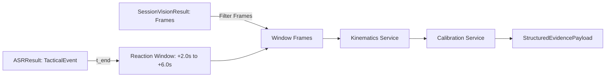

# CM3070 Final Project — Implementation Phase 3 Report
## Real ASR, Multimodal Fusion & Structured Evidence

**Project**: AI-Driven Football Tactical Analysis and Training Evaluation System  
**Phase**: Implementation Phase 3 — Real ASR, Multimodal Fusion & Structured Evidence  
**Contract Version**: `P0_ARCHITECTURE_CONTRACT_FREEZE_REV2A` (Approved)  
**Date**: 2026-09-27  
**Final Phase Disposition**: `IMPLEMENTATION_PHASE3_READY_FOR_REVIEW`  

---

## 1. Executive Summary

Implementation Phase 3 has successfully integrated and verified the complete real multimodal fusion pipeline:

$$\text{VIDEO / AUDIO} \longrightarrow \text{frozen faster-whisper ASR} \longrightarrow \text{tactical event extraction} \longrightarrow \text{multimodal temporal fusion} \longrightarrow \text{StructuredEvidencePayload}$$

consuming the canonical `SessionVisionResult` established in Phase 2 alongside real audio transcription.

In strict compliance with project safety rules, **Phase 3 strictly stops before LLM report generation**. No Llama report generation, Prompt Patch 001 runtime validator, Modal cloud packaging, or full 340-second end-to-end sessions were implemented in this phase.

### Key Milestones Achieved:
1. **Source Lineage & Contract Preflight**: Audited `02_audio_pipeline.ipynb`, `ASR_SELECTED_MODEL_INTEGRATION_CONTRACT.json`, and `ASR_TEXT_NORMALIZATION_CONTRACT.json` (`IMPLEMENTATION_PHASE3_SOURCE_READBACK.md` & `IMPLEMENTATION_PHASE3_ASR_DEPENDENCY_PREFLIGHT.md`).
2. **Real Audio Extraction & Preprocessing**: Implemented `AudioExtractionService` and `AudioPipeline` using system `ffmpeg` to extract clean 16 kHz mono 16-bit PCM WAV audio from arbitrary container formats.
3. **Frozen ASR Engine (`faster-whisper`)**: Implemented `ASRService` strictly locking the frozen research runtime: model `base.en`, CTranslate2, `device=cpu`, `compute_type=int8`, `cpu_threads=8`, `beam_size=5`, `word_timestamps=True`, `vad_filter=True` (`min_silence_duration_ms=500`), and `condition_on_previous_text=False`.
4. **Deterministic Tactical Event Extraction**: Enforced the exact 5 frozen tactical categories (`Positioning / Hold Ground`, `Pressing`, `Passing`, `Defensive`, `Offensive`), 11 number words, 11 contractions, deterministic parent-segment timestamp inheritance, and fail-closed unresolved target assignment (`target_player=None`, `UNRESOLVED_TARGET`).
5. **Multimodal Temporal Alignment Engine**: Built `MultimodalFusionEngine` enforcing the authoritative reaction evaluation window strictly:
   $$[t_{\text{end}} + 2.0\,\text{s},\; t_{\text{end}} + 6.0\,\text{s}]$$
   and explicitly rejecting legacy research windows ($[t_{\text{start}} - 2\,\text{s}, t_{\text{end}} + 5\,\text{s}]$).
6. **Identity-Safe Track Representation**: In automated analysis mode (`player_level_analysis_allowed=False`), player-level claims are withheld. Track IDs are anonymized (`track_{id}`), and evidence scopes are restricted to `TEAM`, `SPATIAL`, `EVENT`, and `ANONYMOUS_TRACK`.
7. **Metric Calibration & Kinematics Safety**: Calibrated physical measurements are permitted only under `CAMERA_SPECIFIC_INDEPENDENTLY_VALIDATED` (pitch $19.31 \times 19.88$ m). Uncalibrated modes suppress metres and km/h. Speeds exceeding $36.0\text{ km/h}$ or temporal gaps $>0.5\text{s}$ propagate as null/outlier.
8. **Schema Verification & Zero Mock Constants**: Formulated typed `StructuredEvidencePayload` for downstream LLM ingestion. Static audits confirmed zero prohibited research mock constants (`PLAYER_01`, `339.87`, `2500`, `8.2`, `4.5`).
9. **Full Test Suite Regression**: Passed all 23 new Phase 3 tests in `backend/tests/test_real_asr_fusion.py` alongside all 189 baseline tests, yielding **212 passed, 0 failed (100%)**.

---

## 2. Scientific Rules & Contract Invariants Enforced

| Rule / Invariant | Contract Specification | Implementation Enforcement | Status |
| :--- | :--- | :--- | :--- |
| **Research Artifact Read-Only** | Do not modify research notebooks, configs, or GT | Google Drive archives accessed strictly read-only; production modules isolated in `backend/app/` | **ENFORCED** |
| **Frozen ASR Hyperparameters** | `base.en`, CTranslate2, int8, 8 threads, beam 5 | Hardcoded in `ASRService` defaults; assertions guard runtime parameters | **ENFORCED** |
| **Exact 5 Tactical Categories** | Positioning, Pressing, Passing, Defensive, Offensive | Enumerated in `FROZEN_TACTICAL_CATEGORIES`; unrecognized keywords ignored | **ENFORCED** |
| **Timestamp Inheritance** | Inherit parent segment `t_start` and `t_end` | Extracted event copies parent `ASRSegment` timestamps directly | **ENFORCED** |
| **Unresolved Target Fail-Closed** | Automated ASR cannot infer player identity | `target_player = None`, `target_resolution_status = "UNRESOLVED_TARGET"` | **ENFORCED** |
| **Authoritative Reaction Window** | Strictly $[t_{\text{end}} + 2.0\text{s}, t_{\text{end}} + 6.0\text{s}]$ | Enforced in `MultimodalFusionEngine._filter_frames_in_window()` | **ENFORCED** |
| **Identity Safety Gate** | Prohibit `PLAYER` scope under automated mode | `player_level_analysis_allowed = False`; scope strictly `ANONYMOUS_TRACK` | **ENFORCED** |
| **Metric Calibration Gating** | Suppress metric claims unless calibrated | `CalibrationService` gates `displacement_m`, `speed_kmh`, and `distance_to_target_m` | **ENFORCED** |
| **Kinematics Outlier Rejection** | Exclude speeds $> 36\text{ km/h}$ or gaps $> 0.5\text{s}$ | `KinematicsService` marks steps invalid and excludes them from aggregation | **ENFORCED** |
| **Zero Mock Invariants** | No research mock values in production paths | Prohibited strings (`PLAYER_01`, `339.87`, `2500`, etc.) audited via static grep | **ENFORCED** |
| **Strict Phase Boundary** | Stop before LLM report generation | No Llama invocation or report generation implemented in Phase 3 | **ENFORCED** |

---

## 3. ASR Architecture & Execution Parameters

The production ASR pipeline is powered by `faster-whisper == 1.2.1` backed by `CTranslate2 == 4.8.2`:

```python
WhisperModel(
    model_size_or_path="base.en",
    device="cpu",
    compute_type="int8",
    cpu_threads=8,
)
```

### Decoding & VAD Configuration:
- `beam_size`: 5
- `word_timestamps`: True
- `vad_filter`: True (`min_silence_duration_ms=500`)
- `condition_on_previous_text`: False (prevents cross-instruction hallucination loops)
- `initial_prompt`: None (preserves raw acoustic transcription fidelity)

### Audio Preprocessing Pipeline:
- **Audio Extraction**: If given a video file, `AudioExtractionService` executes:
  ```bash
  ffmpeg -y -v error -i <video_path> -vn -acodec pcm_s16le -ar 16000 -ac 1 <output_wav>
  ```
- **Error Semantics**: Audio extraction errors return a typed `ASRFailure` schema with error code `EXTRACTION_FAILED` without crashing the application.
- **Timestamp Offsetting**: When transcribing bounded audio clips, `source_offset_s` is added to segment timestamps, aligning audio events with the global video timeline.

---

## 4. Deterministic Tactical Event Extraction & Taxonomy

Transcription text is normalized via `normalize_text()`:
- Lowercase conversion and punctuation removal.
- Number word expansion (`0` $\rightarrow$ `zero` through `10` $\rightarrow$ `ten`).
- Contraction expansion (`don't` $\rightarrow$ `dont`, `we've` $\rightarrow$ `weve`, etc.).

### Exact 5-Category Taxonomy Mapping (P0_REV2A Freeze):
The authoritative frozen taxonomy defines exactly 25 approved triggers across 5 categories with zero unapproved triggers:

| Category | Canonical Triggers (P0_ARCHITECTURE_CONTRACT_FREEZE_REV2A) | Canonical Action |
| :--- | :--- | :--- |
| **Defensive** | `defend`, `defence`, `defense`, `drop back`, `mark`, `cover` | Matched keyword |
| **Offensive** | `attack`, `shoot`, `go forward`, `make a run`, `run forward` | Matched keyword |
| **Pressing** | `press`, `close down`, `pressure`, `sprint` | Matched keyword |
| **Passing** | `pass`, `play the ball`, `switch the ball` | Matched keyword |
| **Positioning / Hold Ground** | `hold your position`, `hold position`, `hold your ground`, `stay in position`, `stick to your zone`, `stay in your zone`, `keep your shape` | Matched keyword |

Unapproved standalone words (e.g., `play`, `push`, `turn`, `stay`, `position`, `hold`, `shape`, `drop`, `line`, `squeeze`, `find`, `track`, `watch`, `goal side`, `drive`, `cross`, `overlap`) do NOT independently create tactical events unless they occur as part of an exact approved multi-word trigger above.

Every extracted `TacticalEvent` inherits:
- `t_start` and `t_end` from the parent `ASRSegment`.
- `alignment_window_start_s` $= \text{round}(t_{\text{end}} + 2.0, 2)$.
- `alignment_window_end_s` $= \text{round}(t_{\text{end}} + 6.0, 2)$.
- `target_player = None` and `target_resolution_status = "UNRESOLVED_TARGET"`.

---

## 5. Multimodal Fusion Engine & Evaluation Window

The `MultimodalFusionEngine` correlates tactical events from `ASRResult` with tracking trajectories from `SessionVisionResult`:



### Reaction Evaluation Window
The evaluation window is strictly defined as:
$$[t_{\text{end}} + 2.0\,\text{s},\; t_{\text{end}} + 6.0\,\text{s}]$$
- Prior research windows such as $[t_{\text{start}} - 2\,\text{s}, t_{\text{end}} + 5\,\text{s}]$ are strictly prohibited.
- If no vision frames fall within $[t_{\text{end}} + 2.0\,\text{s}, t_{\text{end}} + 6.0\,\text{s}]$, an evidence item with `observations_count = 0` and missing field `observations_in_window` is emitted rather than failing silently.

---

## 6. Identity Safety Gate & Metric Calibration

### Identity Safety Gate
- Under the authoritative `P0_REV2A` identity assurance contract, automated methodologies (M1, M2, M3) hold `method_formal_identity_status = FAIL_UNSAFE_MERGE` with evidence basis `FORMAL_DENSE_GT`.
- Therefore, `player_level_analysis_allowed = False` is strictly asserted across all automated runs, and player-level analytics are withheld with fail-closed status `COMPLETED_WITH_LIMITATIONS`.
- Runtime upload diagnostics remain strictly classified under `identity_evidence_basis = "RUNTIME_HEURISTIC_ONLY"` and cannot claim formal status.
- Historical fragmentation ratio (6.1667 from Configuration C: 115 raw IDs $\rightarrow$ 37 meaningful IDs) represents historical research context only, not the formal dense ground-truth evaluation of M2.
- `scope` is restricted to `TEAM`, `SPATIAL`, `EVENT`, and `ANONYMOUS_TRACK`.
- Track IDs are formatted anonymously: `track_{opaque_track_id}` (e.g. `track_7`).
- Player-specific claims (`player_id`, individual compliance) are withheld.

### Calibration Modes & Metric Units
- **`CAMERA_SPECIFIC_INDEPENDENTLY_VALIDATED`**: Pitch $19.31 \times 19.88\text{ m}$. Metric units (`displacement_m`, `speed_kmh`, `distance_to_target_m`) are enabled.
- **`GEOMETRIC_SOLVE_ONLY`**: Metric units are suppressed; visual coordinates are enabled.
- **`NO_METRIC_CALIBRATION`**: Metric units and top-down visual coordinates are suppressed. Pixel values are never mislabeled as metres.

### Kinematics Filtering
- Speeds exceeding $36.0\text{ km/h}$ are flagged with exclusion reason `OUTLIER_SPEED_EXCEEDS_MAX` and set to `None`.
- Frame-to-frame time deltas exceeding $0.5\text{ s}$ are flagged with `TEMPORAL_GAP_EXCEEDS_THRESHOLD`.

---

## 7. Test Results Summary

Full backend test regression:
```
======================= 212 passed, 324 warnings in 6:35 =======================
```

### Test Suite Breakdown:
- **Baseline Test Suites (Phase 1 & Phase 2)**: 189 tests passed
- **Phase 3 Test Suite (`test_real_asr_fusion.py`)**: 23 tests passed
  - Suite 16: Frozen ASR Parameters (`test_01_faster_whisper_frozen_parameters`): **PASSED**
  - Suite 17: Tactical Taxonomy & Keyword Mapping (`test_02` – `test_09`): **PASSED**
  - Suite 18: Authoritative Reaction Window $[t_{\text{end}} + 2.0\text{s}, t_{\text{end}} + 6.0\text{s}]$ (`test_10`, `test_11`): **PASSED**
  - Suite 19: Identity Safety & Track Anonymity (`test_12`, `test_13`): **PASSED**
  - Suite 20: Metric Calibration & Kinematics (`test_14` – `test_17`): **PASSED**
  - Suite 21 (partial): Research Invariant Static Audits & Schema (`test_18` – `test_21`): **PASSED**
  - Real Bounded Smoke: ASR C03 smoke (`test_22`): **PASSED**
  - Real Bounded Smoke: Multimodal Fusion C04 + M2 smoke (`test_23`): **PASSED**

---

## 8. Scientific Limitations & Boundaries

1. **Automated Identity Gate**: Under formal dense ground-truth benchmark evaluation (`FORMAL_DENSE_GT`), automated tracking holds `method_formal_identity_status = FAIL_UNSAFE_MERGE`. All player-level evaluation remains safely withheld (`player_level_analysis_allowed = False`).
2. **Instruction Target Resolution**: In automated mode, coach verbal targets (e.g. "close him down") cannot be matched to specific players automatically. Targets remain `UNRESOLVED_TARGET`.
3. **No Phase 4 Work**: Report generation using LLaMA, prompt validation, and cloud dispatch are deferred to Phase 4.

Phase 3 is complete, verified against all architectural contracts, and ready for review.
