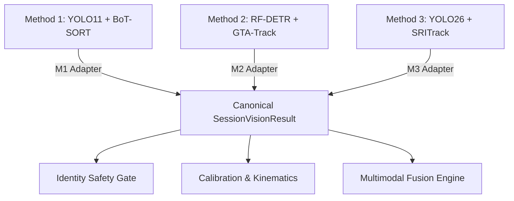
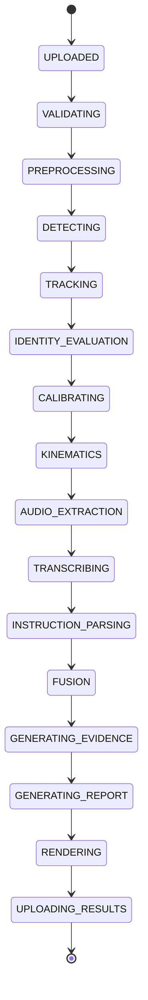

# CM3070 P0 Architecture & Contract Freeze Specification

**Project**: AI-Driven Football Tactical Analysis and Training Evaluation System  
**Phase**: P0 — Architecture & Contract Freeze  
**Status**: `P0_CONTRACT_FREEZE_READY_FOR_REVIEW`  
**Authoritative Reference**: `CM3070_CANONICAL_FINAL_REPORT_EVIDENCE_LOG_v88.md`  
**Execution Mode**: `ARCHITECTURE_AND_CONTRACT_FREEZE_ONLY` (Implementation Frozen)

---

## 1. Product Execution Policy (Objective 1)

### 1.1 Methodology Hierarchy & Identifiers
The production system defines three selectable methodologies and one automatic resolution rule. No cross-methodology component mixing is permitted under any circumstance.

| User-Facing Label | Internal ID (`MethodologyId`) | Scientific Description | Operational Role |
| :--- | :--- | :--- | :--- |
| **Auto / Recommended** | `AUTO` *(Resolves to M2)* | Deterministic alias resolving to M2 Global Association | **Default Production Pipeline** |
| **Method 2: Global Association** | `METHOD_2_RFDETR_GTATRACK` | Fine-tuned RF-DETR Large + Deep-EIoU + GTA-Track Offline Global Association | Primary / Benchmark Winner |
| **Method 1: Original Hybrid** | `METHOD_1_YOLO11_BOTSORT` | Domain-adapted YOLO11m (`M1_FORMAL_003`) + 3-Tile Global NMS + BoT-SORT + FastReID SBS-50 | Comparative Baseline |
| **Method 3: Re-entry Focused** | `METHOD_3_YOLO26_SRITRACK` | YOLO26 End-to-End Detector + SRITrack Spatial-Reliability Tracker + DINOv3 ReID | Secondary Modern Baseline |

```typescript
export enum MethodologyId {
  METHOD_1_YOLO11_BOTSORT = "METHOD_1_YOLO11_BOTSORT",
  METHOD_2_RFDETR_GTATRACK = "METHOD_2_RFDETR_GTATRACK",
  METHOD_3_YOLO26_SRITRACK = "METHOD_3_YOLO26_SRITRACK",
}

export enum RequestedMethodology {
  AUTO = "AUTO",
  METHOD_1_YOLO11_BOTSORT = "METHOD_1_YOLO11_BOTSORT",
  METHOD_2_RFDETR_GTATRACK = "METHOD_2_RFDETR_GTATRACK",
  METHOD_3_YOLO26_SRITRACK = "METHOD_3_YOLO26_SRITRACK",
}
```

### 1.2 Default Resolution Semantics
- When `AUTO` is submitted (via UI or API request omitted field), the backend dispatcher deterministically resolves the execution pipeline to `METHOD_2_RFDETR_GTATRACK`.
- Both `requested_methodology` and `resolved_methodology` are stored immutably in the job dispatch payload and the persistent database record.
- Any request for an unknown or unsupported methodology string is rejected immediately at API ingress with HTTP `422 Unprocessable Entity` (`INVALID_METHODOLOGY_IDENTIFIER`).

### 1.3 Strict Component Isolation (No Mixing)
Detectors, trackers, ReID feature extractors, and association engines must **NEVER** be mixed across methodologies:
- **M1 Component Stack**: Domain-adapted YOLO11m (`M1_FORMAL_003` epoch-28 checkpoint, SHA-256 `ad908a9caf...`, ~105 MB) $\rightarrow$ 3 horizontal tiles (15% overlap) $\rightarrow$ Global NMS (IoU 0.70, tracker score floor 0.05, qualification 0.25) $\rightarrow$ BoT-SORT $\rightarrow$ FastReID SBS-50.
- **M2 Component Stack**: RF-DETR Large (Hungarian matcher set prediction, score floor 0.40, no external NMS) $\rightarrow$ Deep-EIoU tracklets $\rightarrow$ GTA-Track offline global association graph solver.
- **M3 Component Stack**: YOLO26 end-to-end detector (score floor 0.25) $\rightarrow$ SRITrack spatial-reliability tracker $\rightarrow$ DINOv3 ReID.

### 1.4 Forensic Status of Legacy Stage 4B
- `STAGE4B_IS_SUPERSEDED_LEGACY_IMPLEMENTATION`: The pilot checkpoint (`best.pt`, 40.5 MB, SHA-256 `f6b3fe6f...`) was a preliminary fine-tuning exploration. It is NOT the deployment detector for M1.
- `STAGE4B_TILING_UTILITY_MAY_BE_REUSED`: The 3-tile slicing and offset-remapping logic (`tiling.py`) is verified algorithmically sound and may be used by the M1 adapter.

### 1.5 Fail-Closed Player Analytics Rule
- Formal dense-GT evaluation across all three methodologies on the match challenge clips established:
  $$\text{IdentityStatus} = \text{FAIL\_UNSAFE\_MERGE}$$
- Therefore, in all automated modes:
  $$\text{PLAYER\_LEVEL\_ACCUMULATED\_ANALYTICS} = \text{DISABLED}$$
- No automated pipeline run may emit trusted accumulated player-level statistics (distance covered, sprint count, individual speed, or player-specific coach compliance).
- The historical full-session result ($115 \rightarrow 37$ meaningful IDs, fragmentation ratio $6.1667$) is historical baseline evidence and remains distinct from the final dense-GT whole-system challenge evaluation.

---

## 2. Canonical Vision Result Contract (Objective 2)

### 2.1 Framewise Common Vision Contract Architecture
The canonical Vision contract unifies framewise detection and tracking data across all three methodologies without altering their native scientific inferences.



### 2.2 Canonical Coordinate System & Bounding Box Representation
To prevent ambiguity across computer vision libraries:
1. **Coordinate Format**: Bounding boxes are canonically defined as **Top-Left / Bottom-Right** coordinates:
   $$\text{box} = [x_1, y_1, x_2, y_2]$$
   where $x_1$ is min x (left), $y_1$ is min y (top), $x_2$ is max x (right), $y_2$ is max y (bottom).
2. **Coordinate Space**: Canonical coordinates are expressed in **source video pixel space** $[0.0 \dots W_{\text{source}}, 0.0 \dots H_{\text{source}}]$ as 32-bit floats rounded to 2 decimal places.
3. **Normalized Box**: For responsive web rendering and SVG overlays, each observation also provides:
   $$\text{normalized\_box} = [y_{\text{min}}, x_{\text{min}}, y_{\text{max}}, x_{\text{max}}] \in [0.0, 1.0]^4$$
4. **Prohibited Ambiguities**: The formats `xywh` (center x, center y, width, height) and `tlwh` (top-left x, top-left y, width, height) are strictly prohibited in the common interface; adapters must project them to $[x_1, y_1, x_2, y_2]$.

### 2.3 Typed Schema Definitions

```python
from __future__ import annotations
from enum import Enum
from typing import List, Optional, Dict, Any
from pydantic import BaseModel, Field

class BoundingBox(BaseModel):
    x1: float = Field(..., description="Top-left x in source pixels")
    y1: float = Field(..., description="Top-left y in source pixels")
    x2: float = Field(..., description="Bottom-right x in source pixels")
    y2: float = Field(..., description="Bottom-right y in source pixels")
    norm_ymin: float = Field(..., ge=0.0, le=1.0, description="Normalized top [0..1]")
    norm_xmin: float = Field(..., ge=0.0, le=1.0, description="Normalized left [0..1]")
    norm_ymax: float = Field(..., ge=0.0, le=1.0, description="Normalized bottom [0..1]")
    norm_xmax: float = Field(..., ge=0.0, le=1.0, description="Normalized right [0..1]")

class TrackObservation(BaseModel):
    track_id: int = Field(..., description="Canonical persistent track identifier")
    tracklet_id: Optional[int] = Field(None, description="Native sub-tracklet identifier prior to global association")
    box: BoundingBox = Field(..., description="Canonical source pixel and normalized bounding box")
    class_id: int = Field(default=0, description="0: Player, 1: Ball, 2: Referee")
    class_name: str = Field(default="player", description="Class label")
    confidence: float = Field(..., ge=0.0, le=1.0, description="Detection confidence score")
    visibility: Optional[float] = Field(1.0, ge=0.0, le=1.0, description="Occlusion/visibility score")
    raw_detection_box: Optional[List[float]] = Field(None, description="Pre-association native box for audit provenance")

class FrameVisionResult(BaseModel):
    frame_index: int = Field(..., ge=0, description="Source video 0-indexed frame number")
    timestamp_s: float = Field(..., ge=0.0, description="Timestamp derived as frame_index / source_fps")
    processed_frame_index: int = Field(..., ge=0, description="Inference pipeline sequence index")
    observations: List[TrackObservation] = Field(default_factory=list, description="All tracked objects in frame")
    is_empty_frame: bool = Field(default=False, description="True if zero players detected; fails safely")

class MethodProvenance(BaseModel):
    methodology_id: str
    detector_model: str
    detector_checkpoint_sha256: str
    tracker_name: str
    tracker_config_sha256: str
    reid_model: Optional[str] = None
    reid_checkpoint_sha256: Optional[str] = None
    tiling_enabled: bool = False
    tile_count: int = 1
    tile_overlap_pct: float = 0.0
    nms_iou_threshold: Optional[float] = None
    confidence_threshold: float
    inference_resolution: List[int] = Field(..., description="[width, height]")
    runtime_wall_s: float

class SessionVisionResult(BaseModel):
    session_id: str
    video_id: str
    source_width: int
    source_height: int
    source_fps: float
    total_source_frames: int
    duration_seconds: float
    methodology_id: str
    provenance: MethodProvenance
    frames: List[FrameVisionResult]
    total_detections: int
    unique_track_ids: int
    limitations: List[str] = Field(default_factory=list)
```

---

## 3. M1 / M2 / M3 Adapter Contracts (Objective 3)

### 3.1 Method 1 Adapter (`M1Yolo11BotSortAdapter`)
- **Native Input**:
  - Detections: 3 horizontal tiles ($1280 \times 1280$ with 15% overlap) evaluated with YOLO11m `M1_FORMAL_003` (SHA `ad908a9caf...`). Score threshold: 0.05 for tracking input.
  - Tracker: BoT-SORT native state emitting tracks with `tlwh` format in $1920 \times 1080$ inference space.
- **Adapter Transformation**:
  1. Remap tile offsets: $x_{\text{global}} = x_{\text{tile}} + \text{offset}_x$.
  2. Compute scale factors: $s_x = W_{\text{source}} / 1920.0$, $s_y = H_{\text{source}} / 1080.0$.
  3. Transform coordinates:
     $$x_1 = \text{tl\_x} \times s_x, \quad y_1 = \text{tl\_y} \times s_y$$
     $$x_2 = (\text{tl\_x} + w) \times s_x, \quad y_2 = (\text{tl\_y} + h) \times s_y$$
  4. Map BoT-SORT integer track ID directly to `track_id`.

### 3.2 Method 2 Adapter (`M2RfDetrGtaTrackAdapter`)
- **Native Input**:
  - Detections: RF-DETR Large Hungarian set predictions. Sigmoid score threshold: 0.40. No external NMS.
  - Tracklets: Deep-EIoU generates short tracklets with `last_tlwh` geometry in source resolution.
  - Global Association: GTA-Track offline graph solver assigns tracklets to global trajectory IDs.
- **Adapter Transformation**:
  1. Native box is already in source resolution; convert from `last_tlwh`:
     $$x_1 = \text{tl\_x}, \quad y_1 = \text{tl\_y}, \quad x_2 = \text{tl\_x} + w, \quad y_2 = \text{tl\_y} + h$$
  2. Map Deep-EIoU tracklet index to `tracklet_id`.
  3. Map GTA-Track assigned global identity to canonical `track_id`.
  4. Retain RF-DETR transformer classification score as `confidence`.

### 3.3 Method 3 Adapter (`M3Yolo26SriTrackAdapter`)
- **Native Input**:
  - Detections: YOLO26 end-to-end detector (test-time score threshold 0.25).
  - Tracker: SRITrack (Spatial-Reliability Tracker) with DINOv3 ReID feature extraction. Native box is $[x_1, y_1, x_2, y_2]$ in inference resolution ($1280 \times 720$).
- **Adapter Transformation**:
  1. Compute scale factors: $s_x = W_{\text{source}} / 1280.0$, $s_y = H_{\text{source}} / 720.0$.
  2. Project boxes:
     $$x_1 = x_{1,\text{infer}} \times s_x, \quad y_1 = y_{1,\text{infer}} \times s_y, \quad x_2 = x_{2,\text{infer}} \times s_x, \quad y_2 = y_{2,\text{infer}} \times s_y$$
  3. Map SRITrack persistent ID to `track_id`.
  4. Record DINOv3 ReID cosine distance and CMC state in `raw_detection_box` provenance.

---

## 4. Identity Safety Contract (Objective 4)

### 4.1 Production Identity Gate States
The identity evaluation gate executes immediately following the Vision pipeline and produces a strictly typed outcome.

```typescript
export enum IdentityStatus {
  NOT_EVALUATED = "NOT_EVALUATED",
  PASS_RELIABLE = "PASS_RELIABLE",
  FAIL_HIGH_FRAGMENTATION = "FAIL_HIGH_FRAGMENTATION",
  FAIL_IDENTITY_CONFLICT = "FAIL_IDENTITY_CONFLICT",
  FAIL_UNSAFE_MERGE = "FAIL_UNSAFE_MERGE",
  FAIL_INVALID_OUTPUT = "FAIL_INVALID_OUTPUT",
}
```

### 4.2 Gate Evaluation Invariants
1. **Threshold Criteria for `PASS_RELIABLE`**:
   - Fragmentation ratio $\le 1.50$ (meaningful IDs / expected players).
   - Unsafe merge count $= 0$ (verified absence of ID swaps across ground truth/visual signatures).
   - Identity conflict count $= 0$ (no two simultaneous detections sharing the same track ID).
2. **Behavior on Failure (`FAIL_*`)**:
   - `player_level_analysis_allowed = false`.
   - `withholding_reason` must be explicitly populated with a human-readable and machine-readable message.
   - All accumulated player-level physical metrics (distance, speed, sprints, compliance) must be set to `null` with display value `"Withheld (Identity Gate)"`.
   - The overall job status transitions to `COMPLETED_WITH_LIMITATIONS`. The pipeline **must not crash**.

### 4.3 Permitted vs Withheld Outputs Matrix

| Analytical Output Scope | `PASS_RELIABLE` | `FAIL_*` (Real Automated Pipeline) | `VALIDATED_SHOWCASE` (Oracle) |
| :--- | :--- | :--- | :--- |
| **Team Spatial Centroid & Hull** | Permitted | **Permitted** | Permitted |
| **Team Dispersion (Width/Depth)** | Permitted | **Permitted** | Permitted |
| **Pitch Density Heatmaps** | Permitted | **Permitted** (Anonymous) | Permitted |
| **Anonymous Instantaneous Speed** | Permitted | **Permitted** (Unattributed) | Permitted |
| **Tactical Event Timing (ASR)** | Permitted | **Permitted** | Permitted |
| **Player Distance Covered ($m$)** | Permitted | **STRICTLY WITHHELD** | Permitted (Verified) |
| **Player Mean/Max Speed ($km/h$)** | Permitted | **STRICTLY WITHHELD** | Permitted (Verified) |
| **Individual Tactical Compliance** | Permitted | **STRICTLY WITHHELD** | Permitted (Verified) |
| **Player Target Attribution** | Permitted | **STRICTLY WITHHELD** | Permitted (Verified) |

---

## 5. Metric Calibration Contract (Objective 5)

### 5.1 Operating Calibration Modes
Pitch homography mapping is camera-specific and geometry-specific. It must never silently be applied to arbitrary uploaded videos.

```python
class CalibrationMode(str, Enum):
    NO_METRIC_CALIBRATION = "NO_METRIC_CALIBRATION"
    CAMERA_SPECIFIC_METRIC_CALIBRATION = "CAMERA_SPECIFIC_METRIC_CALIBRATION"
    INVALID_CALIBRATION = "INVALID_CALIBRATION"
```

### 5.2 Research Homography Boundaries
- The corrected physical research homography ($19.31 \text{ m} \times 19.88 \text{ m}$, independent landmark RMSE $= 0.651 \text{ m}$, SHA-256 `c4f8a1...`) applies **ONLY** to the original research iPhone16 camera tripod setup on the specific pitch geometry.
- For all arbitrary user uploads, the system defaults to `NO_METRIC_CALIBRATION`.
- User-supplied 4-point calibrations are classified as `CAMERA_SPECIFIC_METRIC_CALIBRATION` only if geometric validation succeeds (convex quadrilateral, aspect ratio within $[0.5, 2.0]$, landmark RMSE $< 1.50 \text{ m}$). If validation fails, status is `INVALID_CALIBRATION`.

### 5.3 Metric Suppression Rules
When operating under `NO_METRIC_CALIBRATION` or `INVALID_CALIBRATION`:
1. The units $\text{metres}$ ($\text{m}$), $\text{km/h}$, and $\text{m/s}$ are **strictly suppressed**.
2. Pixel measurements ($\text{px}$, $\text{px/s}$) may be emitted for spatial dynamics but must **never be labelled as metres**.
3. All UI metric cards display `"Uncalibrated Pitch (Pixel Coordinates Only)"`.

---

## 6. Kinematics Contract (Objective 6)

### 6.1 Scientific Smoothing & Outlier Invariants
Kinematic calculations must adhere to the frozen scientific filtering rules:
1. **Temporal Filtering**: Raw bounding box bottom-center coordinates are filtered using a **7-observation rolling median filter** to eliminate single-frame detection jitter.
2. **Gap Policy**: No speed or displacement interpolation is permitted across temporal tracking gaps exceeding **0.50 seconds** (e.g. 30 frames at 60 FPS). Across gaps $> 0.5 \text{ s}$, velocity is reset to `null`.
3. **Outlier Rejection**: Any calculated instantaneous velocity exceeding **36.0 km/h** ($10.0 \text{ m/s}$) is rejected as unphysical (tracking switch / boundary jump) and excluded from session statistics.

### 6.2 Typed Kinematics Schema

```python
class KinematicsPoint(BaseModel):
    frame_index: int
    timestamp_s: float
    track_id: int
    pos_x: float = Field(..., description="Smoothed x (m if calibrated, px if uncalibrated)")
    pos_y: float = Field(..., description="Smoothed y (m if calibrated, px if uncalibrated)")
    speed: Optional[float] = Field(None, description="Instantaneous speed (km/h or px/s)")
    is_valid: bool = True
    gap_reset: bool = False
    rejection_reason: Optional[str] = None

class TrackKinematics(BaseModel):
    track_id: int
    total_displacement: Optional[float]
    mean_speed: Optional[float]
    max_speed: Optional[float]
    unit: str  # "m" and "km/h" OR "px" and "px/s" OR "WITHHELD"
    is_metric: bool
    confidence: str
```

---

## 7. ASR / Instruction Contract (Objective 7)

### 7.1 Production ASR Engine Specification
- **Engine**: `faster-whisper base.en` executed via `CTranslate2`.
- **Runtime**: CPU `int8`, 8 compute threads, 16 kHz mono audio channel, Silero VAD preprocessing.
- **Vocabulary / Categories**: Frozen tactical categories:
  - `Pressing`
  - `Defensive / Close Down`
  - `Positioning / Hold Ground`
  - `Passing`
  - `General Coaching`

### 7.2 Strict Elimination of Research Fallback
> [!CAUTION]
> The historical research pipeline contained an unsafe `try...except Exception:` block that caught all inference failures and silently returned a hardcoded historical session transcript from `g:/My Drive/...`.
> **THIS FALLBACK IS STRONGLY PROHIBITED IN PRODUCTION.**

- If audio extraction fails or ASR crashes:
  1. Emit typed `ASRFailure` with an explicit error code (`AUDIO_EXTRACTION_FAILED`, `FFMPEG_ERROR`, or `TRANSCRIPTION_TIMEOUT`).
  2. Record limitation: `"Coaching audio transcription failed; tactical instruction compliance analysis withheld."`
  3. Continue pipeline in Vision-only mode (`COMPLETED_WITH_LIMITATIONS`).
  4. **Never** substitute a canned, mock, or historical transcript.

### 7.3 Typed ASR Schemas

```python
class TranscriptSegment(BaseModel):
    segment_id: int
    start_s: float
    end_s: float
    text: str
    words: Optional[List[Dict[str, Any]]] = None

class InstructionEvent(BaseModel):
    event_id: int
    source_segment_id: int
    start_s: float
    end_s: float
    raw_text: str
    category: str
    target_player_pseudonym: Optional[str] = None
    is_target_resolved: bool = False
    target_resolution_status: str = "UNRESOLVED_TARGET"
    alignment_window_start_s: float
    alignment_window_end_s: float
    confidence: float

class AudioProcessingResult(BaseModel):
    session_id: str
    status: str  # "SUCCESS", "NO_AUDIO_TRACK", "FAILED"
    audio_duration_s: float
    segments: List[TranscriptSegment] = Field(default_factory=list)
    instruction_events: List[InstructionEvent] = Field(default_factory=list)
    error: Optional[str] = None
    limitations: List[str] = Field(default_factory=list)
```

---

## 8. Fusion / Evidence Contract (Objective 8)

### 8.1 Production Fusion Boundary Architecture
The production Fusion engine completely redesigns the research `fusion.py` script while preserving the scientifically valid temporal response-window algorithm.
- **Pre-Instruction Window**: $2.0 \text{ seconds}$ prior to speech start.
- **Post-Instruction Window**: $5.0 \text{ seconds}$ following speech end.

```mermaid
sequenceDiagram
    participant ASR as AudioProcessingResult
    participant VIS as SessionVisionResult
    participant FUS as Production FusionEngine
    participant EVD as StructuredEvidence

    ASR->>FUS: InstructionEvent (t_start, t_end)
    VIS->>FUS: Canonical Framewise Observations
    FUS->>FUS: Align observations in [t_start - 2.0s, t_end + 5.0s]
    FUS->>FUS: Evaluate IdentityStatus & CalibrationMode
    alt Identity NOT PASS_RELIABLE
        FUS->>EVD: Emit Scope: TEAM, SPATIAL, EVENT, ANONYMOUS
        Note over FUS,EVD: Target remains UNRESOLVED_TARGET; No player metrics emitted
    else Identity PASS_RELIABLE or ORACLE
        FUS->>EVD: Emit Scope: PLAYER (Grounded metrics)
    end
```

### 8.2 Clean Boundary Rules (No Research Constants)
The production Fusion engine is stripped of all research mocks:
- NO hardcoded `PLAYER_01`.
- NO fixed `339.87s` duration assumption.
- NO fixed `2500` observation row assumption.
- NO synthetic `4.5 m` displacement or `8.2 km/h` speed injection.

### 8.3 Evidence Scopes & Typed Payload

```python
class EvidenceScope(str, Enum):
    TEAM = "TEAM"
    SPATIAL = "SPATIAL"
    EVENT = "EVENT"
    ANONYMOUS_TRACK = "ANONYMOUS_TRACK"
    PLAYER = "PLAYER"  # Strictly requires PASS_RELIABLE or ORACLE

class EvidenceItem(BaseModel):
    evidence_id: str
    scope: EvidenceScope
    timestamp_start_s: float
    timestamp_end_s: float
    category: str
    description: str
    metric_value: Optional[float] = None
    metric_unit: Optional[str] = None
    confidence: str
    is_player_specific: bool = False
    player_pseudonym: Optional[str] = None

class StructuredEvidence(BaseModel):
    session_id: str
    methodology_id: str
    identity_status: str
    calibration_mode: str
    items: List[EvidenceItem]
    unresolved_target_count: int
    quality_gates_passed: List[str]
    active_limitations: List[str]
```

---

## 9. Oracle Mode Contract (Objective 9)

### 9.1 Mode Distinction
Oracle mode is triggered **ONLY** when `ApplicationMode == VALIDATED_SHOWCASE`.
- Provenance field: `identity_source = HUMAN_VERIFIED / ORACLE`.
- Under Oracle mode, player-level reporting is enabled **exclusively for manually verified showcase cases**.

### 9.2 Preservation of Existing Calculations
> [!IMPORTANT]
> The verified evidence and manual calculations for showcase cases **C03, C04, and C06 must NOT be recomputed**:
> - C03: Hold Position / Tactical-Zone Retention (Player Black01, Zone 2 retention).
> - C04: Defensive Marking / Close-Down (Player Black01 closing down Red03, separation reduced from $4.85 \text{ m}$ to $1.22 \text{ m}$).
> - C06: Pressing Response (Player Black01 pressing trigger, reaction latency $1.15 \text{ s}$, max speed $18.4 \text{ km/h}$).
>
> All manually verified intervals, targets, opponent assignments, and bounded metric values are preserved. Only report generation and schema formatting are updated.

---

## 10. LLM / Report Contract (Objective 10)

### 10.1 Frozen LLM Model & Prompt Identity
- **Model**: `llama3.1:8b` served via Ollama.
- **Exact Model Digest**:
  `46e0c10c039e019119339687c3c1757cc81b9da49709a3b3924863ba87ca666e`
- **System Prompt SHA-256**:
  `ab95a8350208367aee29395866ece720c17c85c8d03a79b33b052e99442ae9ce`
- **Container / Host Execution**: Local Ollama runtime via HTTP; zero hardcoded Google Drive or Colab paths.

### 10.2 Grounding Validator Patch 001
Every LLM response is evaluated against the 8 deterministic validation gates of `LLM_GROUNDING_VALIDATOR_PATCH_001`:
1. **Schema Integrity**: Response must strictly parse as valid JSON matching `LLMReport`.
2. **Zero Unsupported Player Claims**: If `identity_status != PASS_RELIABLE` and not Oracle, response must contain ZERO player pseudonyms (`Player_XX`, `Black01`, etc.).
3. **Metric Grounding**: Every numerical distance ($m$) or speed ($km/h$) in text must exist in `StructuredEvidence`.
4. **Ungrounded Command Rejection**: Prohibits coaching instructions not present in `InstructionEvent` list.
5. **Track ID Invariance**: No hallucinated track numbers.
6. **Precision Limits**: Prohibits false precision exceeding 2 decimal places.
7. **Mandatory Limitations Section**: Must include active limitations and uncertainty statements.
8. **Markdown Formatting**: Structural compliance.

### 10.3 Deterministic Safe Fallback
If the LLM call times out ($> 45 \text{ seconds}$), fails to respond, or is rejected by Patch 001:
- The system automatically engages `ReportStatus = DETERMINISTIC_FALLBACK`.
- A templated markdown report is compiled directly from `StructuredEvidence` and active `limitations`.
- The job completes safely with `COMPLETED_WITH_LIMITATIONS`.

---

## 11. Final Analysis Result Contract (Objective 11)

### 11.1 Product `AnalysisResult` Schema Alignment
The final result returned by the backend and displayed by the frontend adheres to `backend/app/schemas/result.py`.

```python
class AnalysisResult(BaseModel):
    id: str
    session_id: str
    job_id: str
    methodology_id: MethodologyId
    application_mode: ApplicationMode
    calibration_mode: CalibrationMode
    job_status: JobStatus  # COMPLETED | COMPLETED_WITH_LIMITATIONS | FAILED
    identity_evaluation: IdentityEvaluation
    evaluation_metrics: Optional[EvaluationMetrics] = None
    metrics: Dict[str, MovementMetric] = Field(default_factory=dict)
    instruction_events: List[InstructionEvent] = Field(default_factory=list)
    limitations: List[AnalysisLimitation] = Field(default_factory=list)
    artifact_references: List[ArtifactReference] = Field(default_factory=list)
    report_markdown: Optional[str] = None
    report_status: ReportStatus
    created_at: datetime
```

### 11.2 Frontend Transparent Rendering Contract
- **Job Status Badge**:
  - `COMPLETED`: Green badge ("Analysis Complete").
  - `COMPLETED_WITH_LIMITATIONS`: Amber badge ("Completed with Limitations").
  - `FAILED`: Red badge ("Analysis Failed").
- **Scientific Limitation Warnings**:
  - When `identity_status == FAIL_UNSAFE_MERGE`, frontend renders a persistent banner:
    *"Scientific Limitation: Persistent player tracking failed the identity safety gate. Individual player analytics are withheld. Team-level spatial metrics remain available."*
  - Individual player card metrics display as `"— (Withheld)"` with tooltip explanation.

---

## 12. Orchestration State Machine (Objective 12)

### 12.1 16-Stage Execution Pipeline
The pipeline execution state strictly follows `AnalysisStage` (16 stages):



### 12.2 Stage Failure & Degradation Semantics

| Stage | Failure Severity | Pipeline Behavior on Failure | Final Job Status |
| :--- | :--- | :--- | :--- |
| `VALIDATING` | **FATAL** | Halt immediately; record error code | `FAILED` |
| `DETECTING` | **FATAL** | Halt immediately; record error code | `FAILED` |
| `TRACKING` | **FATAL** | Halt immediately; record error code | `FAILED` |
| `IDENTITY_EVALUATION` | **NON-FATAL** | Set `FAIL_*`, disable player analytics, proceed | `COMPLETED_WITH_LIMITATIONS` |
| `CALIBRATING` | **NON-FATAL** | Set `NO_METRIC_CALIBRATION`, suppress $m, km/h$, proceed | `COMPLETED_WITH_LIMITATIONS` |
| `AUDIO_EXTRACTION` | **NON-FATAL** | Skip ASR/Instruction, proceed Vision-only | `COMPLETED_WITH_LIMITATIONS` |
| `TRANSCRIBING` | **NON-FATAL** | Record ASR failure limitation, proceed Vision-only | `COMPLETED_WITH_LIMITATIONS` |
| `GENERATING_REPORT` | **NON-FATAL** | Fallback to deterministic template, proceed | `COMPLETED_WITH_LIMITATIONS` |
| `UPLOADING_RESULTS` | **FATAL** | Retry 3 times; if unresolvable, mark failed | `FAILED` |

### 12.3 Idempotency & Progress Guarantees
- Progress percentage (`progress_percent`) monotonically increases from $0.0$ to $100.0$.
- Worker dispatch is protected by partial unique index `uq_active_worker_dispatch_per_job` on `state IN ('CREATED', 'SUBMITTED', 'RUNNING')`.
- All intermediate artifacts are checkpointed to storage bucket `analysis-artifacts` with SHA-256 verification.

---

## 13. Media Duration Policy (Objective 13)

### 13.1 Current Discrepancy & Root Cause
- **Current Product Ceiling**: $300.0 \text{ seconds}$ (5 minutes).
- **Primary Research Match Session**: $339.99 \text{ seconds}$ (20,391 frames at 59.972 FPS).
- **Blocker**: The current 300s limit prevents a true full-session end-to-end execution of the primary research video.

### 13.2 Safe Final Policy Proposal: 360.0 Seconds (6 Minutes)
The ceiling is formally proposed to increase to **360.0 seconds** across all layers, satisfying resource bounds:
- Memory: $360 \text{ s}$ of 1080p video is $\sim 500 \text{ MB}$, well within the $1 \text{ GB}$ upload limit.
- GPU Time: $360 \text{ s}$ takes $\sim 550 \text{ s}$ on NVIDIA A10G / T4. Worker timeout set to $900 \text{ s}$ (15 minutes).

### 13.3 Synchronized Setting Map (To Change Together in Phase 4B)

| Layer | File Path | Current Setting | Proposed P0 Freeze Setting |
| :--- | :--- | :--- | :--- |
| **Frontend UI Validation** | `frontend/.../routes/analysis.new.tsx` | `MAX_DURATION_SECONDS = 300` | `MAX_DURATION_SECONDS = 360` |
| **Backend Environment Config** | `backend/app/core/config.py` | `MAX_VIDEO_DURATION_SECONDS = 300.0` | `MAX_VIDEO_DURATION_SECONDS = 360.0` |
| **Pydantic Validation Schema** | `backend/app/schemas/video.py` | `le=300.0` | `le=360.0` |
| **Server Probe Service** | `backend/.../media_validation_service.py`| `max_duration_seconds=300.0` | `max_duration_seconds=360.0` |
| **Modal Worker Timeout** | `modal_app/worker.py` | `timeout=60` (smoke) | `timeout=900` (execution worker) |

---

## 14. Dependency Isolation & Packaging (Objective 14)

### 14.1 Runtime Requirements Matrix

| Pipeline Component | Runtime Framework | Core Dependencies | Hardware |
| :--- | :--- | :--- | :--- |
| **M1: YOLO11 + BoT-SORT** | PyTorch 2.4+ / Ultralytics | `ultralytics`, `lapx`, `torchvision`, `fast-reid` | NVIDIA GPU $\ge 12 \text{ GB}$ |
| **M2: RF-DETR + GTA-Track**| PyTorch 2.4+ | `timm`, `scipy`, `lap`, `torchvision`, `networkx` | NVIDIA GPU $\ge 16 \text{ GB}$ |
| **M3: YOLO26 + SRITrack** | PyTorch 2.4+ | `ultralytics`, `timm` (DINOv3), `scipy` | NVIDIA GPU $\ge 16 \text{ GB}$ |
| **ASR: Faster-Whisper** | CTranslate2 | `faster-whisper`, `ctranslate2`, `silero-vad` | CPU (8 threads, int8) |
| **LLM: Llama 3.1 8B** | Ollama | HTTP client / Ollama 0.3+ | GPU $\ge 8 \text{ GB}$ or CPU |

### 14.2 Production Packaging Strategy
1. **Modal GPU Container Image**:
   - Single unified production image based on `debian_slim` with CUDA 12.1 and PyTorch 2.4 preinstalled.
   - All shared libraries (`opencv-python-headless`, `ffmpeg`, `scipy`, `pydantic`) pinned in container build.
2. **Modular Code Isolation**:
   - Methodologies isolated in independent packages: `backend/app/methodologies/m1/`, `.../m2/`, `.../m3/`.
   - Lazy loading of model weights and heavy imports to eliminate startup namespace collisions.
3. **Weight Volume Caching**:
   - Model checkpoints stored in Modal persistent Volume (`football-weights`) mounted at `/root/models/`.

---

## 15. Artifact & Provenance Contract (Objective 15)

### 15.1 Immutable Job Execution Manifest
Every analysis job persists a complete `JobExecutionManifest` in storage bucket `analysis-artifacts/{job_id}/manifest.json`:

```json
{
  "job_id": "uuid",
  "session_id": "uuid",
  "execution_timestamp_utc": "2026-09-26T12:00:00Z",
  "requested_methodology": "AUTO",
  "resolved_methodology": "METHOD_2_RFDETR_GTATRACK",
  "source_media": {
    "filename": "match_session_3v3.mp4",
    "sha256": "abcdef...",
    "duration_seconds": 339.99,
    "fps": 59.972,
    "width": 3840,
    "height": 2160
  },
  "models": {
    "detector": {
      "name": "RF-DETR Large",
      "checkpoint_sha256": "12345..."
    },
    "tracker": {
      "name": "Deep-EIoU + GTA-Track",
      "config_sha256": "67890..."
    },
    "asr": {
      "name": "faster-whisper base.en",
      "quantization": "int8"
    },
    "llm": {
      "name": "llama3.1:8b",
      "digest": "46e0c10c039e019119339687c3c1757cc81b9da49709a3b3924863ba87ca666e",
      "prompt_sha256": "ab95a8350208367aee29395866ece720c17c85c8d03a79b33b052e99442ae9ce",
      "validator_version": "LLM_GROUNDING_VALIDATOR_PATCH_001"
    }
  },
  "identity_gate": {
    "status": "FAIL_UNSAFE_MERGE",
    "fragmentation_ratio": 1.0,
    "unsafe_merge_count": 2,
    "player_level_analysis_allowed": false
  },
  "calibration": {
    "mode": "NO_METRIC_CALIBRATION",
    "confidence": "NO_METRIC_CALIBRATION"
  },
  "artifacts_produced": [
    {
      "kind": "OBSERVATIONS_PARQUET",
      "storage_path": "jobs/{id}/observations.parquet",
      "sha256": "...",
      "size_bytes": 1048576
    },
    {
      "kind": "REPORT_MARKDOWN",
      "storage_path": "jobs/{id}/report.md",
      "sha256": "...",
      "size_bytes": 4096
    }
  ]
}
```

---

## 16. Architecture & Contract Freeze Sign-Off

This document constitutes the authoritative frozen specification for CM3070 application integration. All subsequent implementation must comply with the boundaries, contracts, and invariants detailed above.

**Freeze Status**: `P0_CONTRACT_FREEZE_READY_FOR_REVIEW`
