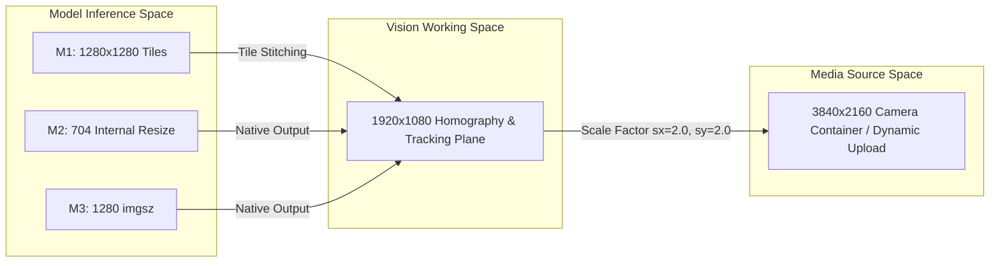

# CM3070 P0 Architecture & Contract Freeze — Final Revision 2 Patch (REV2)

**Project**: AI-Driven Football Tactical Analysis and Training Evaluation System  
**Phase**: P0 — Architecture & Contract Freeze (Final Revision 2)  
**Status**: `P0_CONTRACT_FREEZE_REV2_READY_FOR_FINAL_REVIEW`  
**Authoritative References**: `CM3070_CANONICAL_FINAL_REPORT_EVIDENCE_LOG_v88.md`, `M1_FINAL_EVALUATION_BASELINE.json`, `M2_FINAL_EVALUATION_BASELINE.json`, `M3_selected_identity_configuration.json`, `M3_detection_reid_cache_prelaunch.json`, `ASR_SELECTED_MODEL_INTEGRATION_CONTRACT.json`, `LLM_FINAL_INTEGRATION_FREEZE.json`, `C03/C04/C06_metric_evidence.json`  
**Execution Mode**: `ARCHITECTURE_AND_CONTRACT_FREEZE_ONLY` (Implementation Frozen)

---

## 1. Product Execution Policy (Objective 1)

### 1.1 Methodology Hierarchy & Identifiers
The production system defines three selectable methodologies and one automatic resolution rule. No cross-methodology component mixing is permitted under any circumstance.

| User-Facing Label | Requested Methodology | Resolved ID (`MethodologyId`) | Scientific Methodology Definition | Operational Role |
| :--- | :--- | :--- | :--- | :--- |
| **Auto / Recommended** | `AUTO` | `METHOD_2_RFDETR_GTATRACK` | Deterministic alias resolving to M2 Global Association | **Default Production Pipeline** |
| **Method 2: Global Association** | `METHOD_2_RFDETR_GTATRACK` | `METHOD_2_RFDETR_GTATRACK` | Fine-tuned RF-DETR Large ($\text{conf} \ge 0.50$, no NMS) + Deep-EIoU (OSNet-x1.0) + GTA-Track Offline Global Association | Primary / Benchmark Winner |
| **Method 1: Original Hybrid** | `METHOD_1_YOLO11_BOTSORT` | `METHOD_1_YOLO11_BOTSORT` | Domain-adapted YOLO11m (`M1_FORMAL_003` epoch-28) + 3-Tile Global NMS + BoT-SORT ($0.35/0.10$, buffer 120, match 0.85) + FastReID SBS-50 | Comparative Baseline |
| **Method 3: Re-entry Focused** | `METHOD_3_YOLO26_SRITRACK` | `METHOD_3_YOLO26_SRITRACK` | YOLO26 End-to-End Detector ($\text{conf} \ge 0.30$) + SRITrack-v1 (`M3_SRC_DEFAULT` amended birth gate $0.30$) + DINOv3 ReID | Secondary Modern Baseline |

```typescript
export enum MethodologyId {
  METHOD_1_YOLO11_BOTSORT = "METHOD_1_YOLO11_BOTSORT",
  METHOD_2_RFDETR_GTATRACK = "METHOD_2_RFDETR_GTATRACK",
  METHOD_3_YOLO26_SRITRACK = "METHOD_3_YOLO26_SRITRACK",
}

export enum RequestedMethodology {
  AUTO = "AUTO",
  METHOD_1_YOLO11_BOTSORT = "METHOD_1_YOLO11_BOTSORT",
  METHOD_2_RFDETR_GTATRACK = "METHOD_2_RFDETR_GTATRACK",
  METHOD_3_YOLO26_SRITRACK = "METHOD_3_YOLO26_SRITRACK",
}

export enum FormalIdentityStatus {
  FAIL_UNSAFE_MERGE = "FAIL_UNSAFE_MERGE",
  FAIL_HIGH_FRAGMENTATION = "FAIL_HIGH_FRAGMENTATION",
  PASS_RELIABLE = "PASS_RELIABLE",
}

export enum IdentityEvidenceBasis {
  FORMAL_DENSE_GT = "FORMAL_DENSE_GT",
  HUMAN_ORACLE = "HUMAN_ORACLE",
  RUNTIME_HEURISTIC_ONLY = "RUNTIME_HEURISTIC_ONLY",
  NOT_AVAILABLE = "NOT_AVAILABLE",
}
```

### 1.2 Default Resolution Semantics
- When `AUTO` is submitted (via UI or API request omitted field), the backend dispatcher deterministically resolves the execution pipeline to `METHOD_2_RFDETR_GTATRACK`.
- Both `requested_methodology` and `resolved_methodology` are stored immutably in the job dispatch payload and the persistent database record.
- Any request for an unknown or unsupported methodology string is rejected immediately at API ingress with HTTP `422 Unprocessable Entity` (`INVALID_METHODOLOGY_IDENTIFIER`).

### 1.3 Exact Final Methodology Baseline Freezes

#### Method 1 Frozen Baseline (`M1_FINAL_EVALUATION_BASELINE.json`)
- **Detector**: YOLO11m domain-adapted checkpoint `runs/method_1/M1_FORMAL_003_DOMAIN_ADAPTED/training/yolo11m_domain_adapted/weights/epoch28.pt`
  - SHA-256: `ad908a9caf757f3f2b68a92d260da85a8308fb115e220b91d1bdccef31393f8b`
  - File Size: `104,950,959` bytes
  - Tiling: 3 horizontal windows at $1920 \times 1080$ ($[0, 712]$, $[605, 1317]$, $[1208, 1920]$)
  - Tile NMS IoU: $0.70$, Global NMS IoU: $0.50$, imgsz: $1280$, half: `true`
  - Standalone qualification confidence: $0.25$, tracker input floor: $0.05$
- **Tracker**: Ultralytics BoT-SORT with external ReID feature bridge
  - `track_high_thresh = 0.35`
  - `track_low_thresh = 0.10`
  - `new_track_thresh = 0.35`
  - `track_buffer = 120`
  - `match_thresh = 0.85`
  - `gmc_method = "none"`
  - `proximity_thresh = 0.15`
  - `appearance_thresh = 0.88`
  - `with_reid = true`
  - `fuse_score = true`

#### Method 2 Frozen Baseline (`M2_FINAL_EVALUATION_BASELINE.json`)
- **Detector**: RF-DETR Large checkpoint `runs/method_2/M2_FORMAL_001_DOMAIN_ADAPTED/checkpoint_best_total.pth`
  - SHA-256: `7539cfb3eca3125136c1446d7a522a5a46abb14136d55f79aec8daececc00b85`
  - Operating Point: **`selection_confidence_inclusive = 0.50`** (formal threshold $\ge 0.50$)
  - Score Semantics: Native sigmoid score; **`external_nms = false`**
  - Model Inference Space: Resized to 704; native box output in $1920 \times 1080$ working space
- **Local ReID**: OSNet-x1.0 checkpoint `runs/method_2/M2_P0_preflight/checkpoints/sports_model.pth.tar-60`
  - SHA-256: `8d5b2fd8763db34c2aad69810466adf413f0426d9f8119d322227e0e639c5fbd`
  - Crop: Clamped to $1920 \times 1080$, resize $[256, 128]$, embedding dimension $512$
- **Local Tracker**: Deep-EIoU from GTATrack-STC2025 (`source_sha256 = 6caecd0f...`, `config_sha256 = a3b96034...`)
  - Parameters: `track_high_thresh = 0.70`, `track_low_thresh = 0.40`, `new_track_thresh = 0.70`, `track_buffer = 90`, `match_thresh = 0.80`, `proximity_thresh = 0.50`, `appearance_thresh = 0.25`, `with_reid = true`
- **Global Association**: GTA-Track Offline Global Association Graph Solver (`M2_GTA_BASELINE_REV1`) operating in $1920 \times 1080$ working space

#### Method 3-v1 Frozen Baseline (`M3_selected_identity_configuration.json` & `M3_detection_reid_cache_prelaunch.json`)
- **Detector**: YOLO26 custom domain-adapted checkpoint `runs/method_3/M3_FORMAL_001_DOMAIN_ADAPTED/checkpoints/M3_ADAPTED_YOLO26M.pt`
  - SHA-256: `ea9b3e434ffd7c2ca7ebcd563497accd90e03cfc8da1e8e9fc883e4790199dbf` (Verified by disk readback and live SHA-256 calculation)
  - File Size: `44,081,689` bytes
  - Operating Point: **`detector_confidence = 0.30`**
  - Inference Parameters: `imgsz: 1280`, `iou: 0.7`, `max_det: 300`, `one_to_many: true`, `classes: [0]`
  - Output Coordinate Space: Ultralytics maps boxes back to input image coordinates ($1920 \times 1080$ working space)
- **ReID Model**: DINOv3 feature extractor (`reid_sha256 = 5f4f1fa2226680c26458872f6241b9a5355d6e29a405fda1acdbcb11874b32f8`), embedding dimension $512$
- **Tracker**: SRITrack-v1 configuration `M3_SRC_DEFAULT` with P5A score compatibility amendment
  - `track_high_th = 0.60`
  - `track_low_th = 0.10`
  - `track_new_th = 0.30` (amended birth gate aligning with 0.30 detector operating point)
  - `track_buffer = 1000`
  - `track_match_th = 0.80`
  - `track_p_th = 0.50`, `track_vc_th = 0.50`, `track_vf_th = 0.25`, `track_b_th = 0.70`
  - `with_reid = true`, `EIoU = true`, `vp_dga = true`, `ris = true`, `det_min_area = 10`
  - Resolved Config SHA-256: `feeeb76e365a7e2c255e5946e7f7e7c67162530ab06112b6a8b83fbd8403f8ed`

---

## 2. Coordinate Space Separation Architecture (Patch Correction 1)

### 2.1 Explicit Three-Space Model
To resolve conflation between camera sensor recording and tracking geometry, the contract defines three distinct coordinate spaces:



1. **`MEDIA_SOURCE_SPACE`**:
   The native pixel coordinate space of the uploaded media container. For the research iPhone 16 video, this is **$3840 \times 2160$** pixels ($W_{\text{source}}=3840, H_{\text{source}}=2160$). For arbitrary uploaded videos, it is probed dynamically via `ffprobe`.
2. **`VISION_WORKING_SPACE`**:
   The fixed **$1920 \times 1080$** tracking, ReID, and planar homography plane. The research pitch homography was fitted in this space ($W_{\text{working}}=1920, H_{\text{working}}=1080$).
3. **`MODEL_INFERENCE_SPACE`**:
   The pixel resolution fed directly into the neural network backbone:
   - M1: 3 tiles of $1280 \times 1280$ with 15% overlap.
   - M2: RF-DETR internal resize to 704 with letterbox padding.
   - M3: YOLO26 internal `imgsz = 1280` inference.

### 2.2 Canonical Output Space Decision
$$\mathbf{Canonical \; BoundingBox} \in \mathbf{MEDIA\_SOURCE\_SPACE}$$
Every observation emitted in `SessionVisionResult` is canonically expressed in **`MEDIA_SOURCE_SPACE`**. This ensures direct compatibility with video rendering, client video overlays, and raw video frame extraction without scaling discrepancies.

### 2.3 Explicit Scale Transformations & Factor-of-Two Protection
For the primary research footage:

$$s_x = \frac{W_{\text{source}}}{W_{\text{working}}} = \frac{3840}{1920} = 2.0$$
$$s_y = \frac{H_{\text{source}}}{H_{\text{working}}} = \frac{2160}{1080} = 2.0$$

#### Exact Adapter Coordinate Pipelines
1. **M1 Adapter**:
   $$\text{Tile Box } [x_1, y_1, x_2, y_2]_{\text{tile}} \xrightarrow{\text{add offset}_x} [x_1, y_1, x_2, y_2]_{\text{working}} \xrightarrow{\times 2.0} [x_1, y_1, x_2, y_2]_{\text{source}}$$
2. **M2 Adapter**:
   RF-DETR outputs boxes in $1920 \times 1080$ working space. Deep-EIoU tracklets and GTA-Track trajectories are computed in $1920 \times 1080$.
   $$[x_1, y_1, x_2, y_2]_{\text{working}} \xrightarrow{\times 2.0} [x_1, y_1, x_2, y_2]_{\text{source}}$$
3. **M3 Adapter**:
   `m3_p4a_cache.py` verifies that YOLO26 predictions and SRITrack tracks are output in $1920 \times 1080$ working space (`bgr.shape == (1080, 1920, 3)`).
   $$[x_1, y_1, x_2, y_2]_{\text{working}} \xrightarrow{\times 2.0} [x_1, y_1, x_2, y_2]_{\text{source}}$$

---

## 3. Formal vs Runtime Identity Status (Patch Correction 2)

### 3.1 Strict Separation of Benchmark Provenance and Runtime Diagnostics
An automated production run on an arbitrary uploaded video lacks dense physical-player ground truth. It is scientifically invalid to report `identity_status = FAIL_UNSAFE_MERGE` on a new video as though an unsafe merge was measured on that upload.

The contract decouples formal methodology evaluation from runtime upload diagnostics:

```python
class IdentityEvaluation(BaseModel):
    # 1. Formal Scientific Benchmark Provenance
    method_formal_identity_status: FormalIdentityStatus = Field(
        FormalIdentityStatus.FAIL_UNSAFE_MERGE,
        description="Frozen identity gate status established on dense-GT whole-system challenge evaluation"
    )
    method_formal_identity_evidence_basis: IdentityEvidenceBasis = Field(
        IdentityEvidenceBasis.FORMAL_DENSE_GT,
        description="Evidence basis for methodology selection (dense ground truth)"
    )

    # 2. Production Upload Runtime Diagnostics
    runtime_identity_status: str = Field(
        "RUNTIME_DIAGNOSTICS_COMPLETED",
        description="Runtime heuristic tracking status (NOT an evaluation of physical player identity)"
    )
    runtime_identity_evidence_basis: IdentityEvidenceBasis = Field(
        IdentityEvidenceBasis.RUNTIME_HEURISTIC_ONLY,
        description="Evidence basis available for arbitrary uploads (heuristics only; no physical GT)"
    )

    # 3. Fail-Closed Attribution Control
    player_level_analysis_allowed: bool = Field(
        False,
        description="Strictly False for all automated production runs"
    )
    withholding_reason: str = Field(
        "Player-level tactical conclusions and accumulated physical metrics are withheld because "
        "the selected automated methodology has not demonstrated sufficiently safe persistent physical-player "
        "identity under formal ground-truth evaluation.",
        description="Authoritative withholding explanation"
    )
    
    # 4. Runtime Heuristic Metrics (Operational diagnostics only)
    raw_track_ids: int = Field(..., ge=0)
    meaningful_identities: int = Field(..., ge=0)
    fragmentation_ratio: float = Field(..., ge=0.0)
    acceptance_threshold: float = Field(default=1.5)
```

### 3.2 Corrected Frontend Limitation Rendering
The frontend limitations banner on `analysis.$jobId.results.tsx` must accurately reflect the decoupled evidence basis:

> **Scientific Limitation Notice**:  
> *"The selected automated tracking methodology has not demonstrated sufficiently safe persistent physical-player identity under formal ground-truth evaluation (`FAIL_UNSAFE_MERGE`). Consequently, accumulated player-level physical and compliance analytics are withheld. Team-level spatial metrics and uncalibrated tracklet dynamics remain available."*

---

## 4. Complete Frozen ASR Execution Contract (Patch Correction 3)

### 4.1 Exhaustive Execution Parameter Registry
The ASR subsystem must be instantiated with the exact parameter set frozen during the formal methodology selection:

| Parameter | Frozen Value | Architectural Scope |
| :--- | :--- | :--- |
| **Library Version** | `faster-whisper==1.2.1` | Pinned Python dependency |
| **Model Checkpoint** | `base.en` (`Systran/faster-whisper-base.en`) | Pinned HuggingFace weights |
| **Execution Engine** | `CTranslate2` | Native C++ inference backend |
| **Compute Type** | `int8` | Quantized CPU execution |
| **CPU Threads** | `8` | Worker compute allocation |
| **Audio Input Spec** | `16 kHz mono PCM WAV` | Single-channel 16-bit uncompressed audio |
| **Task** | `transcribe` | Spoken language transcription |
| **Language** | `en` | English forced decoding |
| **Beam Size** | `5` | Beam search width |
| **Word Timestamps** | `true` | Sub-word alignment enabled |
| **VAD Filter** | `true` | Voice activity detection enabled |
| **Min Silence Duration**| `500 ms` | Minimum silence split threshold |
| **Condition on Prev Text**| `false` | Prevents runaway hallucinations across splits |

### 4.2 Text Normalization & Tactical Keyword Extractor
1. **Text Normalization Rules (6 Mandatory Steps)**:
   - Lowercase conversion.
   - Apostrophe contraction mapping (`im`, `dont`, `youre`, `cant`, `its`, `were`, `theyre`, `wont`, `hes`, `shes`, `lets`).
   - Hyphen and underscore conversion to whitespace.
   - Punctuation stripping (retains alphanumeric and single spaces).
   - Cardinal digit expansion 0 through 10 (`0` $\rightarrow$ `zero` $\dots$ `10` $\rightarrow$ `ten`).
   - Whitespace collapse to single space and trim.
2. **Exact Five Schema Categories**:
   - `Defensive`: `"defend"`, `"defence"`, `"defense"`, `"drop back"`, `"mark"`, `"cover"`.
   - `Offensive`: `"attack"`, `"shoot"`, `"go forward"`, `"make a run"`, `"run forward"`.
   - `Pressing`: `"press"`, `"close down"`, `"pressure"`, `"sprint"`.
   - `Passing`: `"pass"`, `"play the ball"`, `"switch the ball"`.
   - `Positioning / Hold Ground`: `"hold your position"`, `"hold position"`, `"hold your ground"`, `"stay in position"`, `"stick to your zone"`, `"stay in your zone"`, `"keep your shape"`.
3. **Timestamp Inheritance Rule**:
   Each extracted tactical event inherits $[t_{\text{start}}, t_{\text{end}}]$ directly from its parent speech segment boundaries.
4. **Target Resolution Governance**:
   All events default to `UNRESOLVED_TARGET` with `target_player_pseudonym = None`.
5. **Absolute Invariants**:
   - Zero hotwords or prompt conditioning.
   - Zero transcript repair or language model rescoring.
   - Zero LLM rewriting prior to event extraction.
   - Zero manual vocabulary patching.
   - **Zero historical transcript fallback**: Audio failure emits explicit `ASRFailure`.

---

## 5. LLM Timeout & Generation Configuration (Patch Correction 4)

### 5.1 Protocol Timeout vs Provisional Policy
- **Formal Scientific Benchmark Protocol**:
  $$\mathbf{FORMAL\_LLM\_BENCHMARK\_TIMEOUT\_SECONDS} = \mathbf{120}$$
  Established during formal benchmark testing (`run_formal_benchmark.py`).
- **Production Operational Policy**:
  $$\mathbf{PRODUCTION\_LLM\_TIMEOUT\_SECONDS} = \mathbf{45} \quad (\text{PROVISIONAL\_PRODUCT\_POLICY})$$
  Configurable via environment variable `LLM_TIMEOUT_SECONDS`, defaulting to 120s if unset.

### 5.2 Frozen Generation Parameters
```python
LLM_GENERATION_OPTIONS = {
    "temperature": 0.0,
    "seed": 42,
    "top_p": 1.0,
    "num_ctx": 4096,
    "retries": 0,  # Zero retry; failure engages deterministic fallback
}
```

### 5.3 Patch 001 Validator Invariant
The 8 deterministic gates of `LLM_GROUNDING_VALIDATOR_PATCH_001` remain unchanged:
- Gate 1: `IDENTITY_SAFETY_NEW_PLAYER_ID`
- Gate 2: `PROHIBITED_PSYCHOLOGICAL_INFERENCE`
- Gate 3: `PRIVACY_NAME_LEAK`
- Gate 4: `UNSUPPORTED_NUMERIC_VALUES` (Full payload leaf traversal with `all_numbers_patched`, tolerance $10^{-4}$)
- Gate 5: `UNRESOLVED_TARGET_BECAME_RESOLVED` (Negation-aware target attribution verification)
- Gate 6: `MISSING_SPEED_INFERRED`
- Gate 7: `UNSUPPORTED_EVENT_CATEGORY`
- Gate 8: `UNSUPPORTED_EVENT_ACTION`

---

## 6. Metric Calibration Safety Matrix (Patch Correction 5)

### 6.1 Calibration Permission Matrix
Solving a homography matrix from 4 points guarantees algebraic zero residual on those points alone. It does not validate metric accuracy.

| Operating Mode | Evidence Basis | Permitted Visualization | Permitted Quantitative Metrics |
| :--- | :--- | :--- | :--- |
| **`CAMERA_SPECIFIC_METRIC_CALIBRATION`** | `CAMERA_SPECIFIC_INDEPENDENTLY_VALIDATED` | 2D Pitch Radar, Ground-Plane Trajectories | **Metres ($m$), Speeds ($km/h, m/s$), Physical Distances** |
| **`CUSTOM_PITCH_CALIBRATION`** | `GEOMETRIC_SOLVE_ONLY` | Bounded 2D Pitch Radar, Normalized Radar | **STRICTLY SUPPRESSED: No $m$, No $km/h$, No Physical Speed** |
| **`NO_METRIC_CALIBRATION`** | `NO_CALIBRATION` | Source-Pixel Video Overlays Only | **STRICTLY SUPPRESSED: Pixels ($px, px/s$) Only** |
| **`INVALID_CALIBRATION`** | `INVALID` | Raw Video Player Only | **STRICTLY SUPPRESSED: Zero Metric Claims** |

---

## 7. Dynamic Job Execution Manifest (Patch Correction 6)

### 7.1 Strictly Dynamic Media Metadata
`JobExecutionManifest` must never assume hardcoded research constants ($339.99\text{s}$, $59.972\text{ fps}$, $3840 \times 2160$, homography SHA, RMSE $0.651\text{m}$). It records actual probed metadata per job:

```python
class JobExecutionManifest(BaseModel):
    job_id: str
    session_id: str
    execution_timestamp_utc: str
    requested_methodology: RequestedMethodology
    resolved_methodology: MethodologyId

    # Actual per-job probed media container metadata
    source_media: ProbedMediaMetadata = Field(
        ...,
        description="Actual probed values: filename, sha256, duration_seconds, fps, width, height, container_format"
    )

    # Formal scientific baseline provenance
    formal_methodology_provenance: Dict[str, Any] = Field(
        ...,
        description="Static baseline records: detector_sha256, tracker_config_sha256, formal_identity_status"
    )

    # Runtime job execution diagnostics
    runtime_diagnostics: Dict[str, Any] = Field(
        ...,
        description="Actual runtime track counts, heuristic metrics, wall-clock execution time"
    )

    # Conditional calibration provenance (Nullable)
    calibration: Optional[CalibrationProvenance] = Field(
        None,
        description="Null unless calibration was applied. If applied, records homography_sha256 and optional rmse_m"
    )

    # Artifact registry
    artifacts_produced: List[ArtifactRecord] = Field(default_factory=list)
```

---

## 8. Kinematics Contract

- Smoothing: Centred rolling median filter over **7 observations per raw track**.
- Gap Policy: Valid frame gap $0 < \Delta_{\text{frames}} \le 120$. Velocity resets across gaps $> 0.50\text{ s}$.
- Outlier Rejection: Strictly frozen as **`REJECT_AND_EXCLUDE_OUTLIER`**:
  $$\text{speed} > 36.0 \text{ km/h} \implies \text{Outlier Rejected and Excluded from Accepted Steps and Averages}$$

---

## 9. Multimodal Fusion Contract

- Response Window:
  $$\text{Evaluation Window} = [t_{\text{instruction\_end}} + 2.0\text{s}, \; t_{\text{instruction\_end}} + 6.0\text{s}]$$
- Evidence Scopes: `TEAM`, `SPATIAL`, `EVENT`, `ANONYMOUS_TRACK`, `PLAYER`.
- Player Scope Rule: `scope = PLAYER` is **strictly prohibited** unless `identity_evidence_basis == HUMAN_ORACLE`.
- Research Mocks: Zero occurrences of `PLAYER_01`, fixed $339.87\text{s}$, fixed $2500$ rows, synthetic $4.5\text{m}$ or $8.2\text{km/h}$.

---

## 10. Dependency Packaging & Isolation

- Requirement: M1, M2, and M3 must remain dependency-isolated and reproducible.
- Preferred Strategy: Unified Modal GPU container labeled **`PROVISIONAL_PENDING_DEPENDENCY_SMOKE`**.
- Packaging Smoke Gate: A pre-integration import smoke test will verify non-conflicting imports across PyTorch 2.4, Torchvision, Ultralytics, CTranslate2, and faster-whisper before container deployment.

---

## 11. Architecture & Contract Freeze Sign-Off

This document constitutes Final Revision 2 of the frozen specification for CM3070 application integration. All subsequent implementation must adhere to these contracts.

**Freeze Status**: `P0_CONTRACT_FREEZE_REV2_READY_FOR_FINAL_REVIEW`
