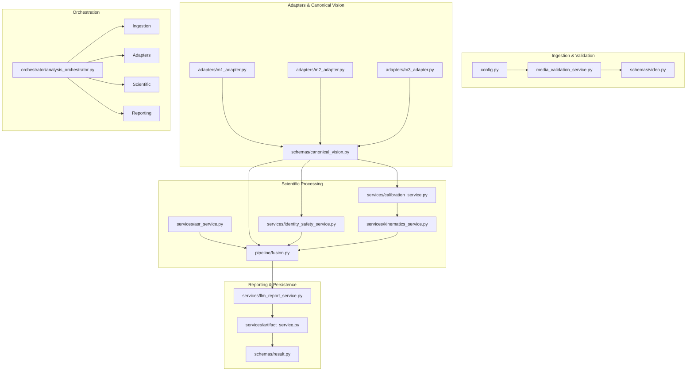

# CM3070 P0 Implementation File Map

**Project**: AI-Driven Football Tactical Analysis and Training Evaluation System  
**Phase**: P0 — Architecture & Contract Freeze  
**Document**: Concrete Implementation File & Subsystem Map  
**Status**: `P0_CONTRACT_FREEZE_READY_FOR_REVIEW`

This document details the exact file-by-file mapping for the upcoming AI pipeline implementation phase. It maps every existing or planned file to its architectural responsibility, research lineage, implementation action, dependencies, and contract validation test.

---

## Master Implementation File Registry

| # | Current / Target File Path | Proposed Responsibility | Source Research Lineage | Action | Dependencies | Validating Contract Test |
| :- | :--- | :--- | :--- | :--- | :--- | :--- |
| **01** | `backend/app/schemas/canonical_vision.py` | Typed framewise common Vision contracts (`SessionVisionResult`, `FrameVisionResult`, `TrackObservation`, `BoundingBox`). | `G:/.../backend/contracts/vision_contract.py` | **NEW / REDESIGN** | `pydantic` | `test_bbox_and_timebase_normalization`, `test_empty_frame_handling` |
| **02** | `backend/app/adapters/m1_adapter.py` | Transforms YOLO11m 3-tile global NMS detections + BoT-SORT tracks into canonical VisionResult. | `m1_baseline_freeze_staging/`, `runs/.../stage_4/` | **NEW** | `canonical_vision.py`, `pipeline/tiling.py` | `test_m1_adapter_to_canonical_vision_result` |
| **03** | `backend/app/adapters/m2_adapter.py` | Transforms RF-DETR set predictions + Deep-EIoU tracklets + GTA-Track global IDs into canonical VisionResult. | `methodology_comparison/runs/method_2/` | **NEW** | `canonical_vision.py` | `test_m2_adapter_to_canonical_vision_result` |
| **04** | `backend/app/adapters/m3_adapter.py` | Transforms YOLO26 detections + SRITrack spatial re-entry + DINOv3 into canonical VisionResult. | `methodology_comparison/runs/method_3/` | **NEW** | `canonical_vision.py` | `test_m3_adapter_to_canonical_vision_result` |
| **05** | `backend/app/services/identity_safety_service.py` | Evaluates persistent identity, calculates fragmentation ratio, checks unsafe merges, enforces fail-closed withholding. | `G:/.../backend/contracts/vision_contract.py` | **ADAPT** | `schemas/identity.py`, `canonical_vision.py` | `test_fail_unsafe_merge_withholding` |
| **06** | `backend/app/services/calibration_service.py` | Geometric pitch validation, homography estimation, RMSE verification, metric unit suppression. | `experiments/homography_validation_physical_corrected/` | **REDESIGN** | `schemas/calibration.py`, `numpy`, `scipy` | `test_no_calibration_withholds_metric_units` |
| **07** | `backend/app/services/kinematics_service.py` | 7-point median smoothing, gap resets (>0.5s), 36 km/h outlier rejection, pixel vs metric velocity. | `physical_metric_upgrade/` | **ADAPT** | `schemas/kinematics.py`, `numpy` | `test_no_calibration_withholds_metric_units` |
| **08** | `backend/app/services/asr_service.py` | Audio extraction, faster-whisper CTranslate2 CPU int8 transcription, tactical keyword parsing, explicit failure emission. | `G:/.../backend/pipeline/asr.py`, `ASR_SELECTED_MODEL_INTEGRATION_CONTRACT.json` | **REDESIGN** | `faster-whisper`, `ffmpeg`, `schemas/instruction.py` | `test_asr_explicit_failure_no_historical_fallback` |
| **09** | `backend/app/pipeline/fusion.py` | Multimodal temporal alignment (-2s to +5s window), structured evidence builder across typed scopes. Strips research mocks. | `G:/.../backend/pipeline/fusion.py` (temporal logic only) | **REDESIGN** | `canonical_vision.py`, `instruction.py`, `identity.py` | `test_fusion_consumes_real_evidence_only`, `test_fusion_forbids_player_scope_under_unsafe_identity` |
| **10** | `backend/app/services/llm_report_service.py` | Local Ollama Llama 3.1 8B client, prompt SHA enforcement, Patch 001 8-gate validator, deterministic fallback. | `methodology_comparison/llm/` | **ADAPT** | `httpx`, `schemas/result.py` | `test_llama_model_digest_and_prompt_hash_enforcement`, `test_grounding_validator_rejection_triggers_safe_fallback` |
| **11** | `backend/app/orchestrator/analysis_orchestrator.py` | 16-stage asynchronous state machine executor, progress reporting, non-fatal limitation routing. | None (Product architecture) | **NEW** | All pipeline services, `SupabaseJobRepository` | `test_vision_only_partial_completion_on_asr_failure`, `test_job_dispatch_idempotency_and_retry` |
| **12** | `modal_app/worker.py` | Serverless GPU worker executing M1/M2/M3 inference, ASR transcription, and artifact compilation. | `modal_app/worker.py` (CPU smoke baseline) | **ADAPT** | `modal`, PyTorch, torchvision, Ultralytics | `test_manual_methodology_selection_executes_isolated_pipeline` |
| **13** | `backend/app/core/config.py` | Updates `MAX_VIDEO_DURATION_SECONDS` from 300.0s to 360.0s. | None | **ADAPT** | `pydantic-settings` | `test_media_duration_policy_accepts_340s_session` |
| **14** | `backend/app/schemas/video.py` | Updates duration validation schema constraint to `le=360.0`. | None | **ADAPT** | `pydantic` | `test_media_duration_policy_accepts_340s_session` |
| **15** | `backend/app/services/media_validation_service.py` | Updates server-side authoritative ffprobe duration limit to 360.0s. | None | **ADAPT** | `media_probe.py` | `test_media_duration_policy_accepts_340s_session` |
| **16** | `backend/app/api/jobs.py` | Ingests job request, resolves `AUTO` $\rightarrow$ M2, verifies requested methodology exists, initial state QUEUED/UPLOADED. | None | **ADAPT** | FastAPI, `schemas/job.py` | `test_auto_methodology_resolves_to_m2` |
| **17** | `backend/app/services/artifact_service.py` | Serializes intermediate Parquet observations, markdown reports, and `manifest.json` with SHA-256 hashes. | None | **ADAPT** | `pyarrow`, `storage_service.py` | `test_job_manifest_provenance_completeness` |
| **18** | `backend/app/schemas/result.py` | Final result container exposing limitations, status, and Oracle showcase payload adapter. | `showcase_final_summary.json` | **ADAPT** | `schemas/*.py` | `test_analysis_result_transparent_limitation_rendering` |
| **19** | `frontend/tactical-ai-insights-main/src/routes/analysis.new.tsx` | Updates UI video duration check to 360s, adds AUTO methodology selector, sets default to M2. | None | **ADAPT** | React, TanStack Router | `test_auto_methodology_resolves_to_m2` |
| **20** | `frontend/tactical-ai-insights-main/src/routes/analysis.$id.tsx` | Transparently renders limitations banner, suppresses player metric cards on `FAIL_UNSAFE_MERGE`. | None | **ADAPT** | React, TanStack Router | `test_analysis_result_transparent_limitation_rendering` |

---

## Subsystem Dependency Graph

---

## Action Classification Definitions
- **NEW**: File does not exist in product repository and will be implemented from scratch adhering strictly to frozen contracts.
- **REDESIGN**: Historical research code exists, but was deemed incompatible or unsafe (e.g. hardcoded constants or broad-exception fallbacks). Logic is redesigned from first principles while preserving validated scientific algorithms.
- **ADAPT**: File exists in product or research workspace and requires specific, bounded modifications to satisfy frozen schemas, parameters, or thresholds.
- **COPY**: Direct copy without structural change (none permitted for AI pipelines without adapter wrapping).
