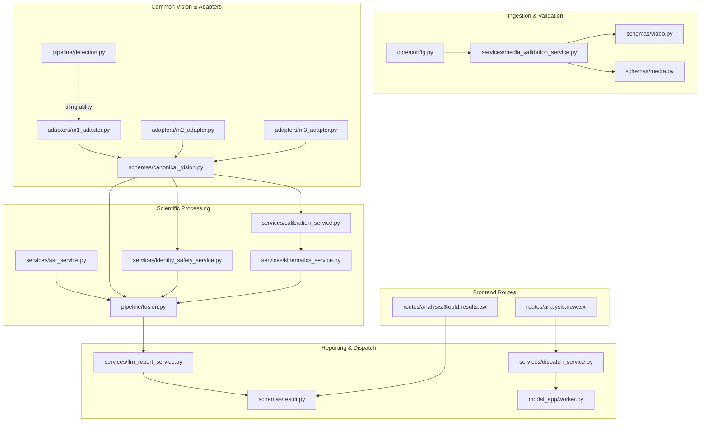

# CM3070 P0 Implementation File Map — Revision 1 (REV1)

**Project**: AI-Driven Football Tactical Analysis and Training Evaluation System  
**Phase**: P0 — Architecture & Contract Freeze (Revision 1)  
**Document**: Authoritative Implementation File Registry & Subsystem Map  
**Status**: `P0_CONTRACT_FREEZE_REV1_READY_FOR_REVIEW`

This document details the concrete, verified filesystem paths for all implementation targets. Every file has been cross-referenced against the actual repository tree to prevent parallel duplicate modules or dead-end paths.

---

## Action Classification Schema
- **`EXISTING_ADAPT`**: File currently exists in the primary product repository and requires bounded, verified modifications.
- **`REPLACE_STUB`**: File currently exists in the repository as a placeholder raising `NotImplementedError`; will be replaced with real contract-compliant logic.
- **`NEW_REQUIRED`**: File does not exist and will be created as a new module.
- **`REDESIGN_EXISTING`**: Existing product file contains research-incompatible or mock logic and will be redesigned from scratch while preserving valid scientific algorithms.

---

## Master Implementation File Registry

| # | Verified Primary Filesystem Path | Classification | Subsystem Responsibility | Source Research Lineage | Validating Contract Test |
| :- | :--- | :--- | :--- | :--- | :--- |
| **01** | `backend/app/schemas/canonical_vision.py` | **NEW_REQUIRED** | Framewise common Vision contract schemas (`SessionVisionResult`, `FrameVisionResult`, `TrackObservation`, `BoundingBox`). Single $[x_1, y_1, x_2, y_2]$ ordering. | `G:/.../backend/contracts/vision_contract.py` (redesigned framewise) | `test_bbox_and_timebase_normalization`, `test_empty_frame_handling` |
| **02** | `backend/app/adapters/m1_adapter.py` | **NEW_REQUIRED** | M1 adapter: Projects YOLO11m 3-tile global NMS detections + BoT-SORT tracks to canonical coordinates; assigns `opaque_track_id`. | `runs/method_1/M1_FINAL_EVALUATION_BASELINE/` | `test_m1_adapter_to_canonical_vision_result` |
| **03** | `backend/app/adapters/m2_adapter.py` | **NEW_REQUIRED** | M2 adapter: Projects RF-DETR-L ($\text{conf} \ge 0.50$, no NMS) + Deep-EIoU tracklets + GTA-Track global IDs to canonical coordinates. | `runs/method_2/M2_FINAL_EVALUATION_BASELINE/` | `test_m2_adapter_to_canonical_vision_result` |
| **04** | `backend/app/adapters/m3_adapter.py` | **NEW_REQUIRED** | M3 adapter: Projects YOLO26 ($\text{conf} \ge 0.30$) + SRITrack-v1 (amended birth gate $0.30$) + DINOv3 to canonical coordinates. | `runs/method_3/M3_P5_identity_calibration/` | `test_m3_adapter_to_canonical_vision_result` |
| **05** | `backend/app/adapters/common_adapter.py` | **NEW_REQUIRED** | Base adapter classes, frame sequence validation, and graceful empty-frame handling (`is_empty_frame=True`). | None (Common Architecture) | `test_empty_frame_handling` |
| **06** | `backend/app/services/identity_safety_service.py` | **NEW_REQUIRED** | Evaluates persistent identity, checks unsafe merges, and enforces fail-closed withholding (`player_level_analysis_allowed = false`). | `vision_contract.py` fail-closed validator | `test_automated_runtime_heuristic_cannot_unlock_player_analytics` |
| **07** | `backend/app/pipeline/identity.py` | **REPLACE_STUB** | Replaces existing `NotImplementedError` stub to dispatch to `IdentitySafetyService`. | None (Primary Pipeline) | `test_automated_runtime_heuristic_cannot_unlock_player_analytics` |
| **08** | `backend/app/services/calibration_service.py` | **NEW_REQUIRED** | Pitch homography solving, independent landmark RMSE validation, and metric unit suppression under uncalibrated mode. | `config/3v3_homography_measured_metric_corrected.json` | `test_four_point_calibration_cannot_claim_independent_rmse` |
| **09** | `backend/app/pipeline/calibration.py` | **REPLACE_STUB** | Replaces existing `NotImplementedError` stub to dispatch to `CalibrationService`. | None (Primary Pipeline) | `test_four_point_calibration_cannot_claim_independent_rmse` |
| **10** | `backend/app/services/kinematics_service.py` | **NEW_REQUIRED** | 7-point median filtering, gap resets across $> 0.5\text{s}$, and outlier rejection (`speed > 36 km/h` excluded from accepted steps). | `physical_metric_upgrade/` | `test_kinematics_outlier_rejection_excludes_over_36kmh` |
| **11** | `backend/app/pipeline/kinematics.py` | **REPLACE_STUB** | Replaces existing `NotImplementedError` stub to dispatch to `KinematicsService`. | None (Primary Pipeline) | `test_kinematics_outlier_rejection_excludes_over_36kmh` |
| **12** | `backend/app/services/asr_service.py` | **NEW_REQUIRED** | Audio extraction from video, faster-whisper CTranslate2 CPU int8 transcription, tactical keyword parsing. Explicit error emission. | `ASR_SELECTED_MODEL_INTEGRATION_CONTRACT.json` | `test_asr_explicit_failure_no_historical_fallback` |
| **13** | `backend/app/pipeline/audio.py` | **REPLACE_STUB** | Replaces existing `NotImplementedError` stub to dispatch to `ASRService`. | None (Primary Pipeline) | `test_asr_explicit_failure_no_historical_fallback` |
| **14** | `backend/app/pipeline/fusion.py` | **REDESIGN_EXISTING** | Multimodal temporal alignment engine using validated $[t_{\text{end}} + 2\text{s}, t_{\text{end}} + 6\text{s}]$ window. Strips research mocks (`PLAYER_01`). | `backend/pipeline/fusion.py` (temporal logic only) | `test_fusion_temporal_response_window`, `test_fusion_consumes_real_evidence_only` |
| **15** | `backend/app/pipeline/evidence.py` | **REPLACE_STUB** | Replaces existing `NotImplementedError` stub to build structured evidence across typed scopes (`TEAM`, `SPATIAL`, `EVENT`, `ANONYMOUS_TRACK`). | None (Primary Pipeline) | `test_fusion_forbids_player_scope_under_automated_mode` |
| **16** | `backend/app/services/llm_report_service.py` | **NEW_REQUIRED** | Local Ollama Llama 3.1 8B client, prompt hash validation, `LLM_GROUNDING_VALIDATOR_PATCH_001` (8 gates), deterministic fallback. | `LLM_GROUNDING_VALIDATOR_PATCH_001.md` | `test_llama_model_digest_and_prompt_hash_enforcement`, `test_patch_001_exact_8_gates_validation` |
| **17** | `backend/app/pipeline/reporting.py` | **REPLACE_STUB** | Replaces existing `NotImplementedError` stub to dispatch to `LLMReportService`. | None (Primary Pipeline) | `test_patch_001_rejection_triggers_safe_fallback` |
| **18** | `backend/app/pipeline/detection.py` | **EXISTING_ADAPT** | Existing file containing Stage 4B horizontal tiling functions (`generate_horizontal_tiles`, `remap_tile_bbox_to_full_frame`, `apply_global_nms`). Export functions for M1. | Stage 4B Tiling Utility | `test_m1_adapter_to_canonical_vision_result` |
| **19** | `backend/app/pipeline/tracking.py` | **REPLACE_STUB** | Replaces existing `NotImplementedError` stub to route tracking requests to selected methodology adapter. | None (Primary Pipeline) | `test_m1_adapter_to_canonical_vision_result` |
| **20** | `backend/app/pipeline/registry.py` | **EXISTING_ADAPT** | Registers production executors for M1, M2, and M3; prevents unselected method loading. | None (Primary Pipeline) | `test_auto_methodology_resolves_to_m2` |
| **21** | `backend/app/services/dispatch_service.py` | **EXISTING_ADAPT** | Verified dispatch service; adapts methodology resolution (`AUTO` $\rightarrow$ `METHOD_2_RFDETR_GTATRACK`) and enforces unique active dispatch. | None (Product Control Plane) | `test_auto_methodology_resolves_to_m2`, `test_asynchronous_orchestrator_heartbeat_and_idempotency` |
| **22** | `backend/app/services/media_validation_service.py` | **EXISTING_ADAPT** | Verified media validation service; adapts authoritative ffprobe video duration ceiling to 360.0s. | None (Product Ingestion) | `test_media_duration_policy_accepts_340s_session` |
| **23** | `backend/app/core/config.py` | **EXISTING_ADAPT** | Updates `MAX_VIDEO_DURATION_SECONDS` from 300.0 to 360.0. | None (System Config) | `test_media_duration_policy_accepts_340s_session` |
| **24** | `backend/app/schemas/video.py` | **EXISTING_ADAPT** | Updates `VideoMetadata` duration validation schema constraint to `le=360.0`. | None (API Schemas) | `test_media_duration_policy_accepts_340s_session` |
| **25** | `backend/app/schemas/media.py` | **EXISTING_ADAPT** | Verified schema defining `MediaAsset` and probe fields; documents server-authoritative duration. | None (Database Models) | `test_media_duration_policy_accepts_340s_session` |
| **26** | `backend/app/schemas/result.py` | **EXISTING_ADAPT** | Aligns `AnalysisResult` Pydantic model with frozen Oracle readback evidence for C03/C04/C06. | `showcase_final_summary.json` | `test_oracle_mode_preserves_verified_readback_metrics` |
| **27** | `backend/app/api/jobs.py` | **EXISTING_ADAPT** | Validates job creation requests, resolves `AUTO` methodology, initializes job in `QUEUED/UPLOADED`. | None (API Routes) | `test_auto_methodology_resolves_to_m2` |
| **28** | `modal_app/worker.py` | **EXISTING_ADAPT** | Adapts serverless worker from CPU smoke to provisional isolated GPU execution for M1, M2, and M3. | `modal_app/worker.py` baseline | `test_asynchronous_orchestrator_heartbeat_and_idempotency` |
| **29** | `frontend/tactical-ai-insights-main/src/routes/analysis.new.tsx` | **EXISTING_ADAPT** | Updates UI validation ceiling to 360s, adds AUTO methodology selector, sets default to M2. | None (Frontend UI) | `test_auto_methodology_resolves_to_m2` |
| **30** | `frontend/tactical-ai-insights-main/src/routes/analysis.$jobId.results.tsx` | **EXISTING_ADAPT** | Verified frontend results route; transparently displays amber limitations banner and disables individual player metric cards. | None (Frontend UI) | `test_automated_runtime_heuristic_cannot_unlock_player_analytics` |

---

## Subsystem Architecture Verification Summary

