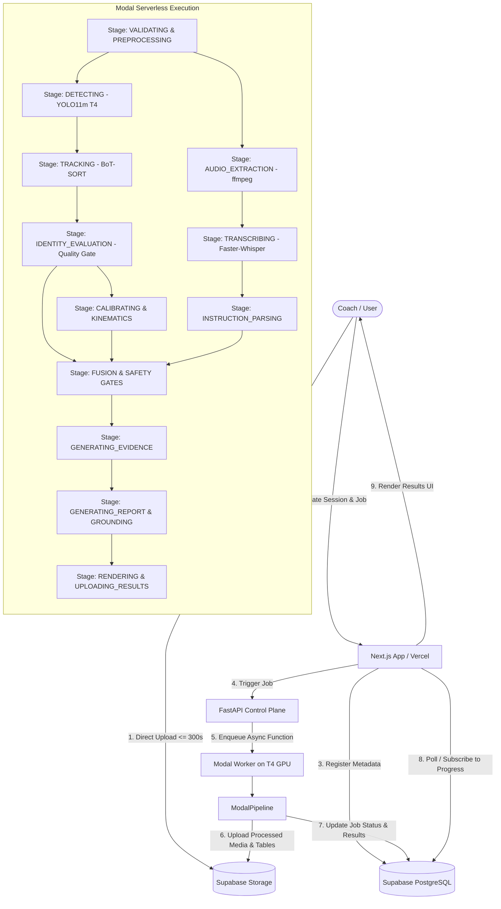

# System Architecture & Technical Design

## 1. Executive Overview

The **AI-Driven Football Tactical Analysis and Training Evaluation System** is a prototype designed to ingest amateur/semi-professional football training video and coach audio, transcribe coach instructions, align visual player movement with spoken commands, evaluate tactical responses, and generate grounded coaching evaluation reports.

The architecture strictly separates:
1. **Automated Analysis Path**: Real-time/asynchronous background processing of newly uploaded training footage using serverless GPU compute, subject to explicit scientific safety gates.
2. **Validated Showcase Path**: An independent, zero-inference presentation layer for manually verified golden demonstration cases (C03, C04, C06).

---

## 2. High-Level Technology Stack

| Layer | Technology | Hosting / Environment | Key Responsibilities |
|---|---|---|---|
| **Frontend** | Next.js (App Router), React, TypeScript, Tailwind CSS, Shadcn UI | Vercel | User interface, video upload initiation, job progress tracking, metric/non-metric reports, golden showcase presentation |
| **Storage** | Supabase Storage (S3-compatible) | Supabase Cloud | Direct browser uploads for raw video (up to 300s), extracted audio, annotated video clips, tabular Parquet/CSV data, golden media |
| **Database** | PostgreSQL + JSONB | Supabase Cloud | Session metadata, job status checkpoints, calibration definitions, instruction events, aggregated results, artifact registries |
| **API Control Plane** | FastAPI (Python 3.10+) | Modal / Container Service | Request validation, job dispatch, signed upload token generation, status polling / webhook handler |
| **Inference & Pipeline** | Modal Serverless Compute (Python) | Modal (NVIDIA T4 on demand) | Video decoding, YOLO11m detection, BoT-SORT tracking, Faster-Whisper ASR, kinematics, multimodal fusion, report generation |

---

## 3. End-to-End Automated Processing Flow

### Detailed Pipeline Stage Descriptions

1. **Upload & Probe (`VALIDATING`, `PREPROCESSING`)**:
   - The browser uploads MP4/MOV footage directly to Supabase Storage via signed pre-authenticated URLs.
   - FastAPI / Modal probes the uploaded file using `ffprobe`.
   - **Enforced Constraints**: Duration $\le 300$ seconds, valid video stream, valid audio stream. Dynamic FPS and native resolution are extracted and stored as immutable job metadata.
2. **Player Detection (`DETECTING`)**:
   - Executes Stage 4B fine-tuned YOLO11m (`best.pt`) on NVIDIA T4 GPU.
   - Applies 3-tile horizontal inference (15% overlap, $1280 \times 1280$, person class only) with global NMS (IoU 0.70) and acceptance confidence threshold 0.20.
3. **Short-Term Tracking (`TRACKING`)**:
   - Associates bounding boxes using BoT-SORT into short-term tracklets.
   - Emits observations: `frame_index`, `timestamp_s`, `track_id`, bounding box coordinates, footpoint coordinate (`[x_mid, y_bottom]`), and detection confidence.
4. **Persistent Identity Evaluation (`IDENTITY_EVALUATION`)**:
   - Computes tracklet reconciliation, cluster counts, and raw vs. meaningful identity ratio.
   - **Scientific Gate**: Checks if `fragmentation_ratio <= 1.5`.
   - In automated mode, because research established `fragmentation_ratio = 6.1667` (`FAIL_HIGH_FRAGMENTATION`), this gate fails safely:
     - Sets `identity_status = FAIL_HIGH_FRAGMENTATION`.
     - Sets `player_level_analysis_allowed = false`.
     - Sets `withholding_reason = "Persistent player identity did not meet the required reliability threshold."`.
     - Flags session for `COMPLETED_WITH_LIMITATIONS`. The pipeline **does not crash**; it continues to team-level/anonymous evaluation.
5. **Pitch Calibration & Mapping (`CALIBRATING`)**:
   - Evaluates calibration mode:
     - `DEMO_FIXED_CALIBRATION`: Applies the research homography matrix only if video matches the research pitch/camera view.
     - `CUSTOM_PITCH_CALIBRATION`: Transforms coordinates using verified user-supplied 4-point pitch corners.
     - `NO_METRIC_CALIBRATION`: Coordinate transforms into metric space are skipped entirely.
6. **Kinematics Calculation (`KINEMATICS`)**:
   - If calibrated: applies 7-observation centered rolling median smoothing on footpoints; calculates displacement and speed ($km/h$).
   - Enforces speed outlier rejection ($> 36\text{ km/h}$). Gaps $> 120$ frames or missing tracking frames are never interpolated.
   - If uncalibrated (`NO_METRIC_CALIBRATION`): metre-based speeds and distances are withheld.
7. **Audio Extraction & Transcription (`AUDIO_EXTRACTION`, `TRANSCRIBING`)**:
   - Extracts 16 kHz mono PCM WAV via `ffmpeg`.
   - Runs Faster-Whisper (`base.en`, CPU int8 or T4 CUDA) with VAD (500 ms silence threshold) and word-level timestamps.
   - Raw transcription is tagged `PRIVATE` and stored securely.
8. **Coaching Instruction Parsing (`INSTRUCTION_PARSING`)**:
   - Deterministically detects keywords, tactical phrases, and instruction categories (e.g. Pressing, Marking, Shape Retention).
   - Pseudonymizes player references; unresolved names are assigned `UNRESOLVED_TARGET`.
9. **Multimodal Fusion & Gate Enforcement (`FUSION`)**:
   - Aligns instruction intervals (e.g., $t_{\text{start}} - 2.0\text{ s}$ to $t_{\text{end}} + 5.0\text{ s}$) with spatial/kinematic observations.
   - **Target Safety Gate**: If instruction target is `UNRESOLVED_TARGET` or `player_level_analysis_allowed == false`, player-specific tactical conclusions are set to `PLAYER_LEVEL_ASSESSMENT_WITHHELD`.
10. **Evidence Assembly & Grounded Reporting (`GENERATING_EVIDENCE`, `GENERATING_REPORT`)**:
    - Synthesizes deterministic evidence summaries (bounding metrics, spatial changes, team spread).
    - Runs structured reporting with strict grounding validator.
    - If LLM response fails validation or is unavailable, falls back deterministically to rule-based coach report.
11. **Results Upload & Notification (`RENDERING`, `UPLOADING_RESULTS`, `COMPLETED`)**:
    - Persists summary JSON, event intervals, and preview clips to Supabase Storage and updates the database row.
    - Job enters `COMPLETED` or `COMPLETED_WITH_LIMITATIONS`.

---

## 4. Validated Showcase Path (Zero Inference)

The Validated Showcase is an independent execution path that displays the manually verified capability demonstrations (C03, C04, C06):

- **No Models Executed**: The showcase path does not invoke YOLO, BoT-SORT, Whisper, or LLM inference.
- **Frozen Golden Artifacts**: Reads strictly from immutable golden payloads and certified media storage manifests.
- **Explicit Provenance**: The frontend clearly displays badges indicating:
  - Mode: `ORACLE_ASSISTED_CAPABILITY_DEMONSTRATION`
  - Status: `PASS_FINAL_ORACLE_ASSISTED_CAPABILITY_SHOWCASE`
  - Verification Scope: Player identities, coach-instruction targets, opponent relationships, and tactical zones were verified by human review.
- **Media Resolution Layer (`golden/media_map.json`)**:
  - The frozen showcase payload JSON references research-relative paths that are mapped via `golden/media_map.json` without altering frozen payload bytes.
  - The `GoldenFixtureService` (`backend/app/services/golden.py`) provides typed `ShowcaseResponse` objects resolving media keys (`c06_pressing_overlay`, `c04_marking_contact_sheet`, `c03_hold_position_overlay`) directly to verified fixtures and future Supabase Storage keys.

---

## 5. Architectural Non-Negotiables

1. **Asynchronous Background Processing**: Video analysis for uploads up to 300 seconds will take minutes. No HTTP connection from the browser or Vercel edge functions may remain blocked. All execution runs via asynchronous Modal jobs with persistent progress checkpoints.
2. **Direct-to-Storage Ingestion**: Raw video files must never be buffered in memory on Vercel or proxied through FastAPI web servers. Direct client uploads to Supabase Storage use signed presigned URLs.
3. **Graceful Limitation Degradation**: When persistent identity fails, the system transitions to `COMPLETED_WITH_LIMITATIONS` and renders team-level tactical observations.
4. **No Arbitrary Metric Projection**: Arbitrary uploaded footage without custom calibration runs strictly in `NO_METRIC_CALIBRATION` mode. Metres and km/h are never fabricated or projected from the research homography.
