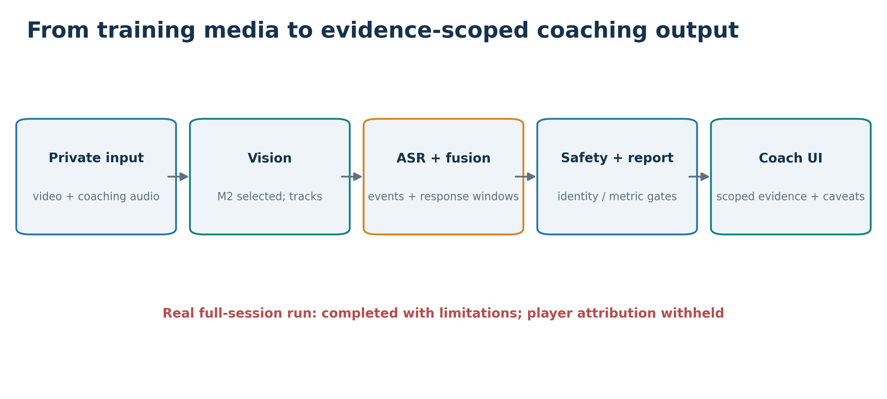

# Chapter 1 — Introduction (846 words, excluding figure caption)

## 1.1 Context and motivation

Football training asks coaches to give instructions while observing many players, movements and responses. A coach cannot follow every interaction at once. Reviewing video afterwards helps, but finding relevant moments and linking them to spoken commands takes time. Observation remains selective; research with youth coaches supports structured performance analysis alongside coaching judgment (Nicholls and Worsfold, 2016). Coaches and analysts also need information presented in football context (Davidson *et al.*, 2024). The Head Coach needs a concise review after training; the Video Analyst needs timestamps and evidence to inspect. Both needs shaped the interface.

My original motivation included **social loafing**, the idea that individual effort may fall in a group setting (Latané, Williams and Harkins, 1979). The preliminary proposal, however, moved too quickly from limited movement to judgments about effort. A player may hold position because the coach asked them to, or appear inactive because the camera missed part of the action. Movement cannot establish motivation or psychological state. I therefore reframed the project around **observable tactical instructions and movement evidence**. The aim is to help staff revisit what can be seen and heard, while leaving judgments about a person's attitude to the coach.

## 1.2 Problem definition and research question

Computer vision can locate and track players; speech recognition can transcribe a coach; language models can produce readable text. Used separately, these capabilities do not show whether an observed movement followed a particular instruction. A timestamped command must be aligned with later visual evidence, and the system must know when a track ID no longer identifies a physical player. A spoken target may remain unresolved, and an anonymous trajectory must not become a named player's response. Likewise, a pitch measurement is meaningful only when the camera has valid calibration. The project's gap is therefore the **safe orchestration** of these parts, rather than player detection alone:

**coach instruction → visual evidence → possible tactical response → grounded report.**

The research question is: **Can a multimodal AI pipeline combine football video and timestamped coaching instructions to support evidence-based tactical training review while withholding conclusions when persistent identity, metric calibration or visual evidence are insufficient?** Answering it requires integration and tests that expose unjustified claims, including missing observations.

## 1.3 Aim and objectives

The aim of this project is **to design, implement and evaluate a multimodal AI system that combines computer vision, speech recognition and grounded language-model reporting to support post-training tactical analysis**. I pursued six objectives:

1. **Evaluate alternative pretrained Vision models and complete tracking methodologies**, including whether their identities remain safe enough for player-level assessment.
2. Compare pretrained speech-recognition alternatives and extract timestamped coaching events from a defined tactical vocabulary.
3. Align instructions with subsequent visual observations through a fixed response window, recording missing or unresolved evidence explicitly.
4. Develop spatial analysis with camera-specific calibration and permit physical measurements only when geometry and identity evidence justify them.
5. Generate readable reports from structured evidence, validate their claims and provide a deterministic fallback when generation fails.
6. Build a private, usable web product; test a full session; and use coach feedback to revise the presentation.

Together, these objectives link candidate observations to temporal context, test their reporting scope and deliver reviewable evidence. Comparative evaluation matters because the preliminary project could not assume that one pretrained model would transfer to this training footage.

## 1.4 Alignment with Project Template 4.1

The project follows **Project Template 4.1 — CM3020 Artificial Intelligence, Project Idea 1: “Orchestrating AI models to achieve a goal.”** It brings together the required three pretrained AI domains. The **visual domain** uses pretrained, then domain-adapted, player detectors with tracking and appearance-based re-identification. The **audio domain** uses pretrained speech recognition to produce timestamped coaching text. The **language domain** uses a pretrained local language model to turn structured evidence into a coaching report. Typed observations pass between stages so later claims can be checked against earlier evidence.

I compared three complete Vision methods, two ASR candidates and two language-model candidates under project-specific protocols. The final application orchestrates the selected paths with timing, identity, calibration and reporting gates. It thus goes beyond a minimal three-model demonstration: models work together toward a useful goal, while the output stays bounded when one model's evidence is weak.

## 1.5 Final contribution and report scope

The completed **AI-Driven Football Tactical Analysis and Training Evaluation System** contributes an integrated path from private training media to timestamped events, scoped visual evidence, guarded reporting and video review. Figure 1.1 summarises that path. Its distinctive contribution is the **permission boundary** around conclusions: comparative Vision research informs the identity gate; calibration controls physical units; missing visual observations remain missing; and generated text must pass grounding checks or fall back to a deterministic report. The product keeps raw participant media private and labels manually verified examples separately from automated results. A real full-session product run and a small coach study tested the system beyond isolated notebooks. Feedback then informed two focused interface iterations.

*Figure 1.1. The integrated product links private media, Vision, coach speech, scoped evidence and reporting; player-level conclusions remained withheld in the full-session run.*

This is a post-training review assistant, not a diagnosis of effort or a guarantee of persistent player identity. Chapter 2 reviews the relevant research; Chapter 3 explains the final design; Chapter 4 follows its implementation; Chapter 5 evaluates the methods, product and users; and Chapter 6 draws the conclusions and future work.
