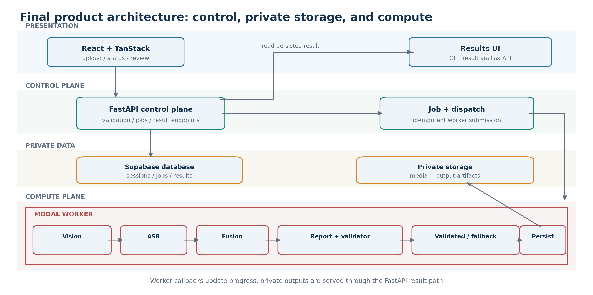
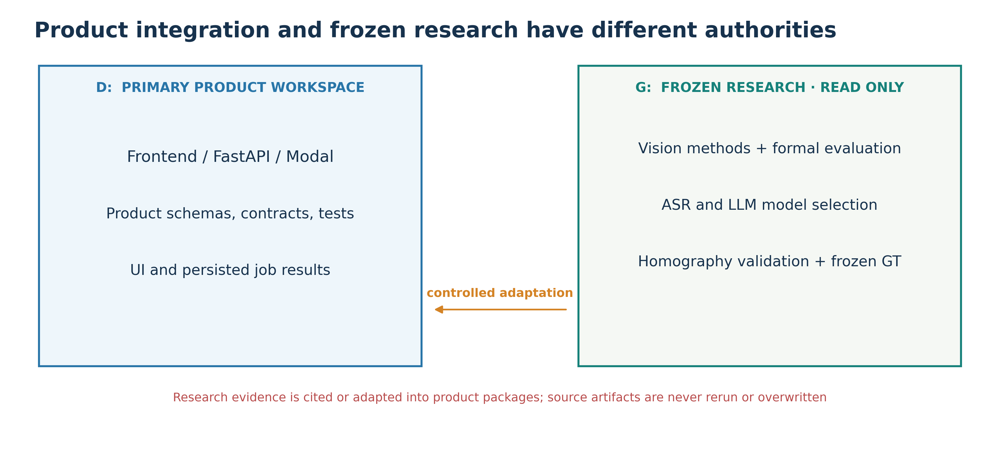
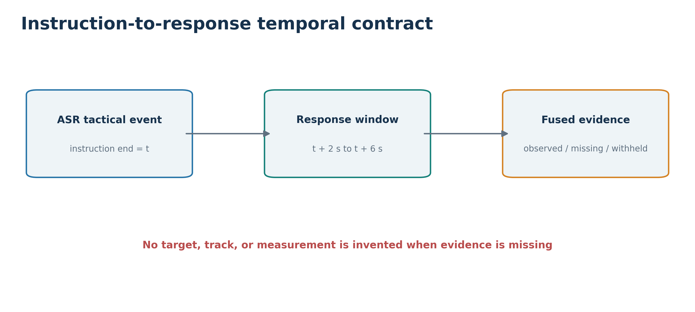
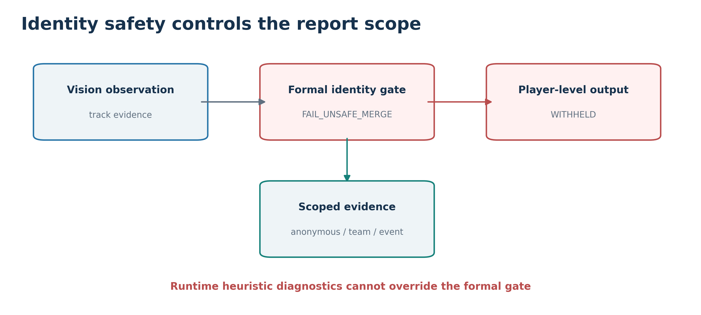
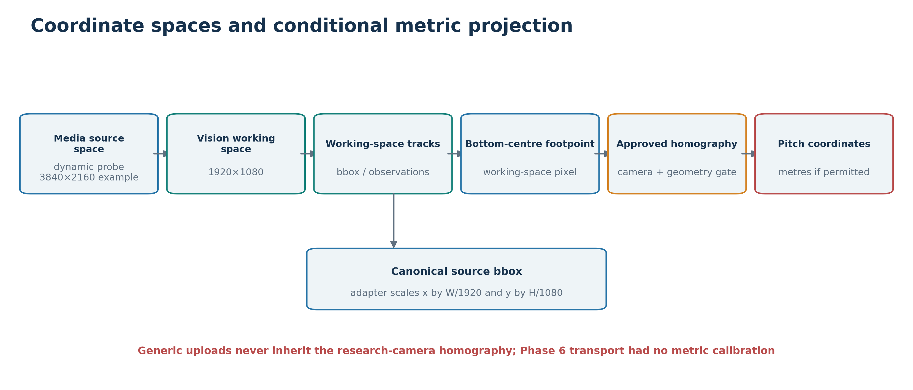
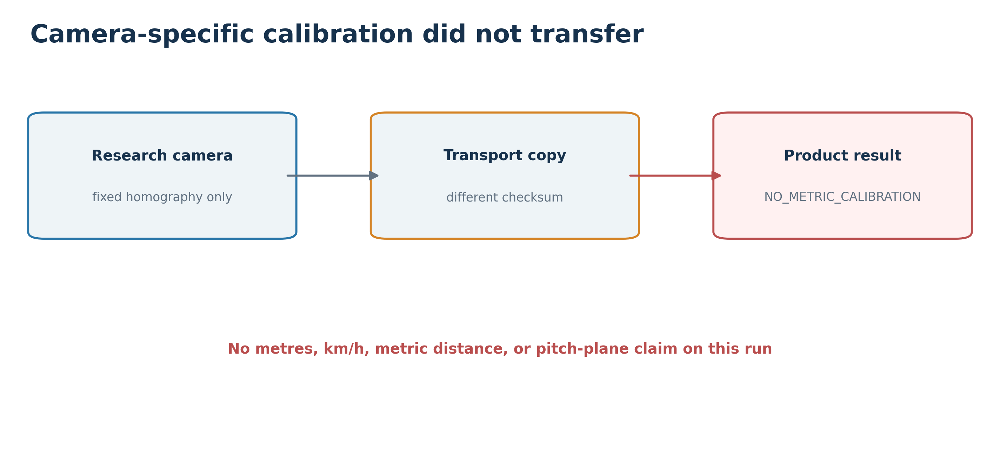

# Chapter 3 — Design (1,700 words, including Table 3.1; excluding figure captions)

## 3.1 Stakeholders and requirements

The preliminary design identified two users whose needs still shaped the finished system. The **Head Coach** needs a quick account of what happened after an instruction, with a route back to the video. The **Video Analyst** prepares media, starts an analysis and needs to inspect timestamps, evidence, method provenance and limitations. I therefore designed a coach-first result: an overview and readable report appear before expandable technical detail, while the underlying events and evidence remain available for scrutiny.

My first specification assumed that tracking would support individual effort and inactivity judgments. Investigating persistent identity changed that requirement. A temporary track label is not a verified physical player, and low movement does not establish low motivation. The final requirement is to report observable tactical evidence at the scope it supports, and to withhold player-level analytics unless identity safety passes. Table 3.1 traces the other main requirements into design decisions and the evaluation that checks them; these are descriptive traceability rows, not identifiers claimed to exist in the preliminary brief.

| Requirement | Final design response | Verification in Chapter 5 |
|---|---|---|
| Review a consented session | Validated private upload, durable job and result | Full-session test |
| Connect speech with play | Timestamped tactical events and bounded response windows | ASR and integration tests |
| Attribute evidence safely | Typed evidence; player scope blocked when identity is unsafe | Vision and full-session evaluation |
| Show spatial/physical context | Coordinate contract and calibration permission gate | Calibration and full-session evaluation |
| Produce a useful explanation | Structured evidence, grounded report and fallback | Reporting evaluation |
| Serve both users | Coach overview, video seek and inspectable technical state | Coach study and UI iteration |

*Table 3.1. Requirements traceability from user need to design and evaluation.*

## 3.2 Final architecture

Figure 3.1 shows the final application that replaced the preliminary image-level prototype. A React/TanStack frontend creates a session and sends media through scoped upload authorisation. FastAPI validates the media and controls the job lifecycle; Supabase holds private objects, relational state and results. An idempotent dispatch sends a job-scoped manifest to a Modal worker. The worker resolves the selected complete Vision method, processes video and coach audio, fuses their outputs, applies safety gates and generates a report. Authenticated callbacks return progress and persisted results to the API, where the frontend retrieves them. The durable job boundary matters: a long analysis can complete independently of an open browser tab, and the displayed result comes from stored evidence rather than a temporary UI calculation.

I made the manifest the handover point between the control plane and compute. It carries the media's probed properties, selected methodology and safety provenance for that particular job. The worker therefore cannot quietly reuse assumptions from the research recording. I kept the three Vision methods as separate complete executors rather than combining whichever detector and tracker happened to look strongest in isolation. Server-side validation, authenticated callbacks and idempotent result persistence were design requirements because a repeated request or lost browser connection must not silently create a different scientific result.

*Figure 3.1. Final product flow from private upload to persisted, scoped results.*

I had to make a second architectural decision during integration. The D: workspace contained the working product, whereas the mounted G: workspace contained the frozen research implementations, model evidence and formal evaluations. Treating the latter as a source to copy wholesale would have mixed experimental code with the application and risked changing the scientific record. Instead, I kept the research artifacts read-only, defined typed product interfaces and adapted the frozen Vision, ASR, Fusion and reporting contracts into them. Figure 3.2 makes that ownership boundary explicit. The drive letters describe development provenance; deployed jobs do not depend on those absolute paths. This separation also made it possible to distinguish an experimentally selected method from a safe product claim: a method can be selected for execution while its identity gate still forbids player attribution.

*Figure 3.2. Product code is owned in the application workspace; frozen scientific evidence is adapted read-only.*

## 3.3 Multimodal data and fusion design

The video path detects and associates people, then emits timestamped observations with boxes and opaque track identifiers. The audio path extracts coach speech, transcribes it and maps only approved phrases into tactical event categories. Neither path alone can answer whether a visible change followed an instruction. To join them, I used the **source media time base**: the job records probed frame rate and media dimensions, while transcript segments and visual observations refer to times within that same recording. The design does not assume the research video's frame rate or resolution for a new upload. A spoken player target that cannot be verified stays unresolved.

The frozen Fusion contract evaluates visual evidence from **two to six seconds after an instruction ends**: `[t_end + 2 s, t_end + 6 s]`. Figure 3.3 depicts that interval. This replaced the preliminary idea of simply pairing speech with behaviour occurring at roughly the same time. The delay separates a completed command from a possible response, but the interval itself does not prove that a response occurred. If it contains no usable observations, the evidence records that absence. Automated outputs are restricted to `TEAM`, `SPATIAL`, `EVENT` or `ANONYMOUS_TRACK` scope; `PLAYER` scope is rejected. An anonymous trajectory can describe a visible local path without pretending that its track number remains the same person throughout a session. This typed boundary lets the report retain useful context even when identity is unsafe. If transcription fails, the run may still present visual evidence, marked as lacking audio context; it does not insert a stored transcript from another recording.

*Figure 3.3. The fixed post-instruction window permits a scoped observation or an explicit absence of evidence.*

## 3.4 Safety architecture

The core design change was to make uncertainty control the **permission to report**, rather than append it as a small disclaimer. The preliminary concept expected individual movement and effort indicators. Formal tracking work showed that persistent physical-player attribution was not sufficiently safe. Accordingly, the identity gate separates detection and short-lived tracking from player-level assessment. If the method's formal safety status fails, `player_level_analysis_allowed` is false and a withholding reason is carried into the persisted result. The job can still finish as `COMPLETED_WITH_LIMITATIONS`, preserving team, event, spatial and anonymous evidence. Figure 3.4 shows this branch; the benchmark failure must not be misrepresented as a newly observed unsafe merge in every uploaded video.

*Figure 3.4. Unsafe persistent identity prevents player-level conclusions while allowing appropriately scoped evidence.*

The same rule is applied at other boundaries. An uncalibrated or merely geometric pitch view cannot authorise metres, distance covered or km/h. A response window without visual observations means **insufficient evidence**, not a player who did nothing. An unresolved spoken target cannot be assigned to whichever track appears nearby. Reporting starts from structured evidence, and a validator rejects unsupported numbers, names, actions or individual attribution. If generation times out, fails its schema or fails grounding checks, the system builds a deterministic report from the permitted evidence instead of treating fluent text as proof. I separated formal method-level identity evidence from runtime diagnostics: a reassuring heuristic on one upload cannot overturn the method's failed formal safety finding. The result remains usable as a limited analysis instead of crashing; unavailable measures remain unavailable rather than becoming zeros. I designed the API result, report and UI to communicate the same withholding state. These gates protect the coaching use case from a particularly damaging error: a confident-looking but wrongly attributed criticism of a player. They also make limitations visible to the analyst, who can inspect why a claim was withheld.

## 3.5 Spatial and calibration design

I separated image coordinates from physical pitch coordinates because the initial fixed-video assumptions would not generalise to uploads. The source video's dimensions and frame rate are probed per job. Vision methods operate on a 1920 × 1080 working image; adapters map their boxes to the source frame, and the bottom-centre footpoint provides the representative ground contact position. Figure 3.5 shows both coordinate provenance and the conditional projection from working pixels through a homography. A pixel coordinate is never labelled as a metre.

*Figure 3.5. Source and working image spaces remain explicit before any authorised pitch projection.*

The research homography is valid only for its measured pitch and matching camera geometry. A separately supplied four-point solve may support a bounded top-down visualisation, but without independent metric validation it does not authorise physical units. No calibration means no metric pitch projection. Figure 3.6 expresses this permission boundary. Thus the design can display useful image-space or non-metric observations for an arbitrary session without silently transferring the research camera's calibration. Metric kinematics also require continuous, valid tracked observations; gaps over 0.5 seconds reset continuity, and speeds above 36 km/h are rejected rather than filled or clamped. These rules were chosen to stop gaps and scale errors becoming plausible-looking performance figures.

*Figure 3.6. Calibration provenance determines whether a pitch view and physical units are permitted.*

## 3.6 Privacy, ethics and user experience

The recording plan used participant information and consent, a fixed tripod view and a coach microphone. The consent process also covered withdrawal and a retention limit. The design avoids face recognition and does not rely on jersey-number recognition to repair identity. Real names are not needed in the report: any verified references should be pseudonymised, while unresolved automated targets remain unresolved. Raw media and unredacted ASR material are private; short-lived, scoped signed URLs allow upload and authorised playback. These choices matter because a training video can expose players and coach instructions even when the model's tactical interpretation is withheld.

The interface follows the same restraint. The coach first sees a plain-language overview, tactical events and a link from an event to its video time. The analyst can open evidence, method, identity and calibration details and inspect the report's basis. The user study later exposed the need for clearer language and report presentation, so I revised the layout without changing the frozen analysis. Keeping the technical state available prevents a concise summary from hiding uncertainty; putting it after the coaching message reduces the burden on a user who only needs to review the session.

## 3.7 Design evolution from preliminary feedback

The preliminary report established the right users and multimodal ambition, but its single-image detector prototype could not test persistent identity, instruction-to-response alignment or safe individual assessment. I used the feedback to move from a list of intended models toward explicit alternatives, measurable contracts and an integrated product. The three complete Vision methods, ASR comparison and grounded reporting study informed what the final design could legitimately promise; their comparative results belong in Chapter 5. I then tested the application with a full session and invited coach feedback, which led to two bounded interface iterations. This sequence responds to the course expectation to revise work after feedback and choose evaluation criteria appropriate to the claim. The resulting design is a record of decisions revised by evidence: preserve the original coaching question, expose what the system actually observed, and withhold conclusions where its evidence stops.
