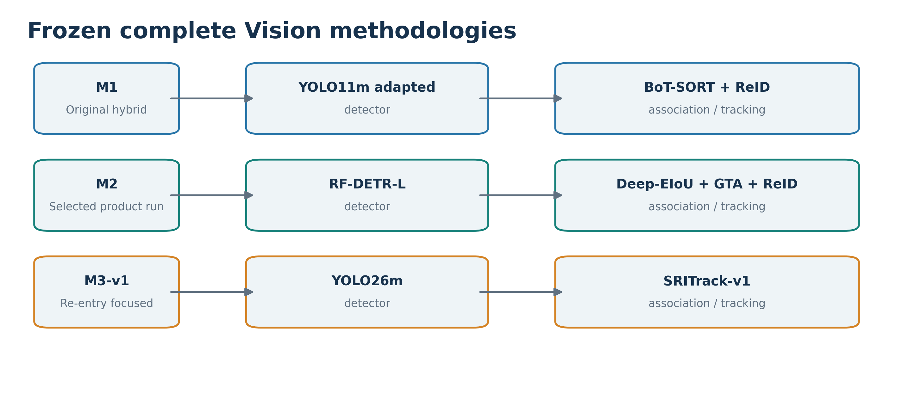
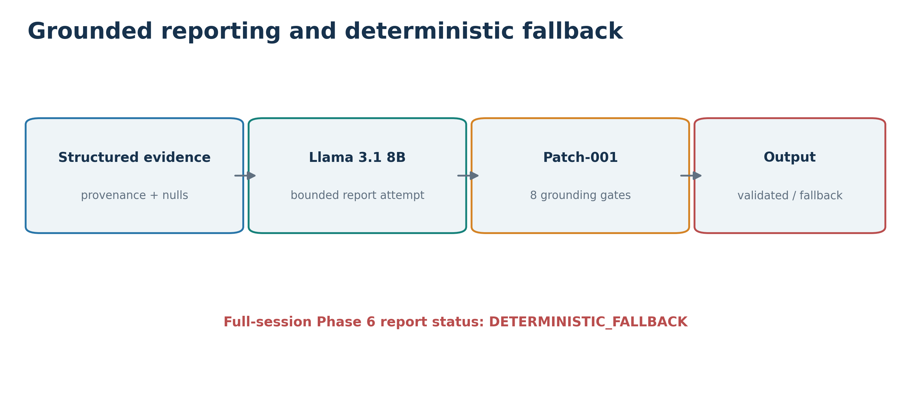
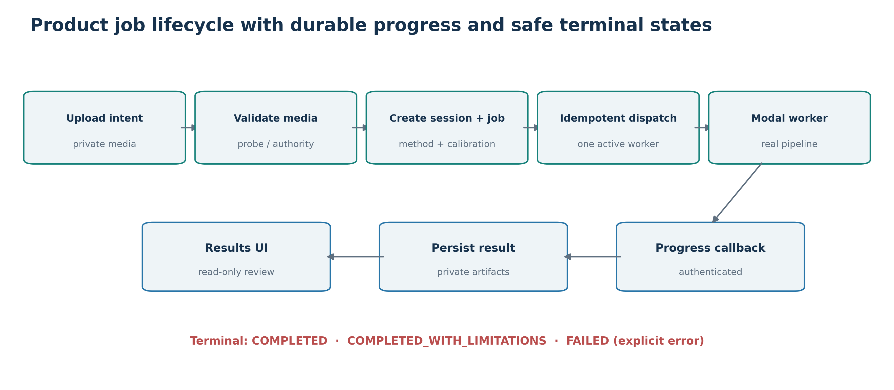
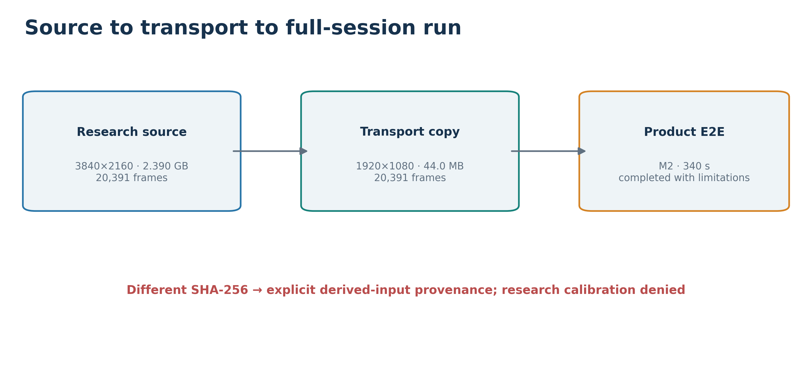
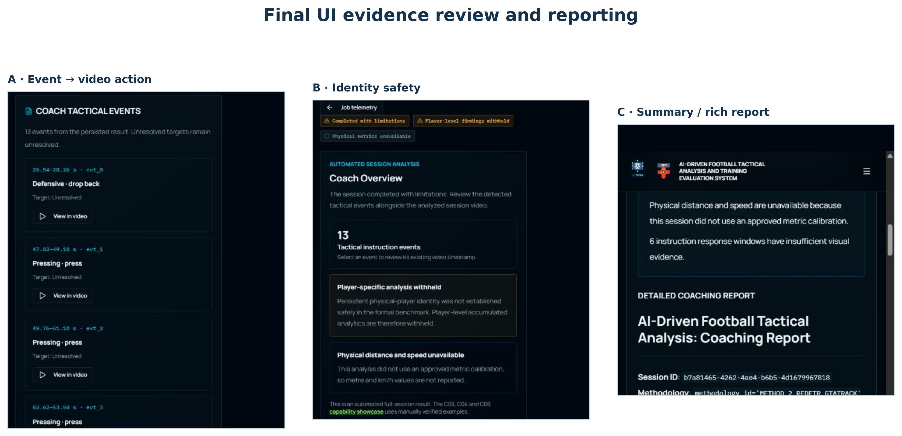

# Chapter 4 — Implementation (2,249 words, excluding figure captions)

## 4.1 From prototype to integrated system

The preliminary prototype was deliberately small: a Google Colab notebook used pretrained YOLOv8m to detect people and a ball in one football image, OpenCV to draw boxes, and Gradio to display the annotated image and a short detection summary. It demonstrated that an image could pass through a model and reach a user interface. It did **not** track players across frames, measure movement, transcribe coach speech, align instructions with video, or use a language model to reason over evidence. Labels such as “Player 1” were image-level box labels, not persistent identities.

I developed the final system by addressing those missing links in sequence. Video detection became a comparison of three complete tracking methods; audio became timestamped tactical events; both entered a typed Fusion contract; and structured evidence fed a validated reporting service. In parallel, I built a separate React/FastAPI product so the outcome could be uploaded, processed remotely, stored privately and reviewed by a coach. The most consequential redesign came from failed identity tests: the application had to remain useful while refusing unsupported individual judgments. The following sections focus on those engineering decisions and the failures that changed them, rather than listing every implementation step.

## 4.2 Vision implementation and three-method research

The first difficult lesson was that a model that detects footballers in a sample image may fail on the actual fixed-camera training footage. An early SoccerTrack-trained YOLO11m checkpoint transferred poorly to the project's custom view. I diagnosed this on protected development data before treating tracker parameters as the cause. The response was a frozen, manually annotated target-domain adaptation split of 100 training and 40 validation frames. All three detector families subsequently used that same target split, although their source-training histories and optimisation differed. This distinction matters: the final study compares **complete systems**, not a controlled single-variable swap of detectors.

Method 1 (M1) combined a domain-adapted YOLO11m detector with three overlapping horizontal tiles, per-tile and global non-maximum suppression, BoT-SORT (Aharon, Orfaig and Bobrovsky, 2022), external YOLO26n ReID embeddings and post-tracking reconciliation. Tiling preserved detail for small distant players, but introduced seam duplicates requiring global suppression. Connecting external detections to BoT-SORT exposed a more subtle bug: ReID feature extraction and crop coordinates did not initially satisfy the tracker's input contract. I corrected the bridge and verified aligned embeddings before calibrating association. The frozen final M1 checkpoint and tracker settings are distinct from the earlier Stage 4B YOLO11m product detector; sharing a model family does not make two experiments equivalent.

Method 2 (M2) used a target-adapted RF-DETR-L detector, Deep-EIoU local association (Huang *et al.*, 2024), sports-trained OSNet ReID and a **modified GTA** tracklet stage (Sun *et al.*, 2024). Its detector-to-tracker score and box contract differed from M1's. GTA could split and reconnect tracklets after local tracking, which addressed fragmentation but also created a risk of joining different, similarly dressed players. I investigated that connector rather than declaring improved continuity to be successful identity. A proposed physics-based veto could not be validated on the development camera without enough independent calibration landmarks, so I did not force a homography or substitute an untested connector. During product integration the GTA path also needed a numerically checked compatibility shim for `cython_bbox` in the worker environment.

Method 3 (M3-v1) combined target-adapted YOLO26m with a modified SRITrack path (Kao, Chou and Lin, 2026) and DINOv3-based appearance features. Its detector bridge preserved real scores and floating-point boxes instead of using SRITrack's reference public-detection assumptions. A structural mismatch surfaced when the track-birth threshold admitted no detections from the adapted detector; I froze a score-compatible amendment before running the planned association configurations. This made the method executable, without claiming it solved re-entry or persistent identity. The later M3-R2 investigation remained outside the selected formal baseline.

Figure 4.1 compares these complete pipelines. I froze method-specific checkpoints and settings, then used the same four challenge clips with fresh tracking state per clip. Raw predictions were saved and hashed before the dense ground truth was loaded for scoring; this kept the final test from becoming another tuning set. M2 was selected as the `AUTO` product method because it had the strongest observed complete-system comparison; Chapter 5 gives the scores and limitations. `AUTO` executes M2's full pipeline and does not silently replace a missing M2 component with one from M1 or M3. None of the three methods passed the separate player-identity safety gate, so selection never authorised accumulated player-level claims.

*Figure 4.1. The three frozen detector, appearance and association stacks compared as complete methods.*

## 4.3 Coordinates, homography and kinematics

Implementing several Vision runners exposed a coordinate error that could have made every later spatial value plausible but wrong. The original research recording was 3840 × 2160, while the common Vision working plane was 1920 × 1080. M1's tile tensors, M2's RF-DETR input and M3's detector input each had different inference dimensions, yet all three runners returned boxes in the **working** plane. I therefore made each adapter emit canonical source-space boxes using `x_source = x_working × W_source / 1920` and the corresponding height ratio for `y`. Applying another model-input-to-working scale would double-scale detections. New uploads use dimensions probed from their own container; 3840 × 2160 is an example, not a runtime constant.

For spatial interpretation, the bottom-centre of a valid player box supplies an approximate footpoint in the working plane. An authorised planar homography can project that point onto the measured pitch. I kept the research homography tied to its original camera/profile, while geometric-only or absent calibration suppresses physical units. This prevented an arbitrary uploaded clip from inheriting metres merely because a matrix was available on disk.

Kinematics use the **actual probed FPS** and a seven-observation median on valid pitch positions. The time between observations is `(frame_i − frame_(i−1)) / fps`; a gap over 0.5 s resets continuity rather than being interpolated. A step above 36 km/h is rejected and excluded, not clamped to the threshold. Even a valid geometric calculation cannot bypass the identity gate: without safe persistent player attribution, accumulated individual distance and speed remain withheld. These checks were implemented as services so Vision and reporting obey the same coordinate and permission rules.

## 4.4 Coach-speech implementation

I moved from the preliminary plan to an executable audio path based on `faster-whisper` `base.en` through CTranslate2 on CPU with int8 inference. Media audio is extracted to 16 kHz mono PCM. The frozen decoding settings use English transcription, beam size five, word timestamps and voice activity detection with a 500 ms minimum silence. Word timing is important because the system evaluates observations after an instruction finishes, not just somewhere near a transcript line. Audio processing is independent of the Vision model so a transcription failure can be represented as a limited Vision-only result.

The transcription is **not** itself a tactical event. I normalise casing, punctuation, contractions, hyphens, digits and whitespace, then match only the frozen set of 25 approved triggers. Those triggers map to exactly five categories: Defensive, Offensive, Pressing, Passing and Positioning / Hold Ground. For example, “close down” maps to Pressing, whereas a broad related word outside the approved mapping cannot create an event by implication. This deterministic layer reduces the temptation to ask a language model to guess the coach's intent from noisy speech.

Player targets presented the same identity problem as video tracks. A recognisable phrase does not prove which physical player was addressed, and an ASR token must not be joined to the nearest track. The automated extractor therefore leaves the target unresolved when it cannot be verified. Raw transcripts remain private. If extraction or transcription fails, the product records that failure and does not substitute a transcript from the historical research session. This fail-closed behaviour preserves the time and provenance of each event that survives into Fusion.

## 4.5 Fusion and grounded reporting

The Fusion implementation joins timestamped tactical events to visual observations in the frozen response window from `t_end + 2 s` to `t_end + 6 s`. It emits structured evidence whose scope is one of `TEAM`, `SPATIAL`, `EVENT` or `ANONYMOUS_TRACK` in automated mode. Each item retains its source event, observation count, nullable measurements, missing fields and limitation codes, so a later sentence can be checked against the underlying record. An opaque track number remains a local trajectory identifier; the schema rejects ordinary automated `PLAYER` evidence. I also had to represent the negative case explicitly: when no tracked observation lies in the window, the record says **insufficient visual evidence**, rather than inventing no movement or tactical non-compliance. Unresolved speech targets, missing kinematics and calibration limits travel with the evidence into reporting.

The report service passes this structured evidence to a frozen local `llama3.1:8b` configuration. Generation uses temperature zero, seed 42, top-p one, a 4096-token context and no retry. More important than those settings is the validator placed after generation. Patch 001 checks eight kinds of grounding: player-identity permission, psychological neutrality, private names, numeric support, negation-aware target attribution, missing-speed claims, tactical category and tactical action. A readable sentence is published only if it survives these checks. Figure 4.2 shows the report path from evidence through validation or deterministic fallback.

*Figure 4.2. Structured evidence governs both the validated Llama path and the deterministic fallback.*

This boundary developed from a practical failure mode: generative text can sound persuasive while adding a number, named player or causal judgment absent from its inputs. A timeout, malformed response or validator rejection therefore produces a deterministic report from the permitted evidence and a visible fallback status; the job need not fail. The showcase's manually verified cases remain labelled as such and cannot be used to claim that automated identity passed. Chapter 5 distinguishes bounded validator tests from the final full-session reporting outcome.

## 4.6 Product engineering and the full-session transport problem

The research notebooks were not a usable end-user workflow, so I connected the methods to a React/TanStack interface and a FastAPI control plane. A session begins with server-validated media metadata and a scoped signed upload into private Supabase Storage. PostgreSQL records sessions, media, jobs and result references; private objects hold source media and analysis artifacts. The server, rather than the browser, validates upload completion and job eligibility. Its dispatch service creates one active job execution, resolves the requested method and sends a job-scoped manifest to Modal. The worker verifies model provenance, processes the media, persists the result and reports progress through authenticated callbacks. The frontend polls durable state and opens the persisted result. Figure 4.3 shows this lifecycle and its limited-completion branch.

*Figure 4.3. Validated private media moves through idempotent dispatch, authenticated worker callbacks and persisted result retrieval.*

I treated idempotency and provenance as scientific as well as operational requirements. A retry must not create a second contradictory report for one job; a worker must not use an unrecorded checkpoint; and a temporary browser disconnection must not erase the analysis state. Product adapters translated frozen research outputs into one canonical result schema while preserving method identity, calibration mode, identity status and evidence scope. This was more work than exposing a notebook endpoint, but it made the result inspectable and reproducible as a product artifact.

Moving that pipeline from notebooks to Modal required its own packaging work. The worker image includes video decoding, computer-vision, ASR and storage dependencies; a private model volume supplies checkpoints, and runtime secrets stay outside the frontend bundle. Before inference, the worker checks the expected M2 checkpoint sizes and hashes. I first ran a bounded cloud smoke to exercise private download, model loading, Vision, ASR, Fusion, persistence and the terminal callback. Only after that path was verified did I attempt the complete recording. This staged test exposed integration failures without treating a four-frame smoke as proof of full-session performance.

The last integration obstacle was media transport. The original 2.39 GB fixed-camera recording received HTTP 413 during Supabase upload initiation. I tested the transport path and produced a deterministic, **full-duration** downscaled copy rather than trimming the session to make the test easy. It preserved all 20,391 frames, approximately 340 seconds and the coach audio while reducing the file to about 44 MB. The copy had its own hash and provenance and was used only for cloud end-to-end execution; it did not replace the original source, dense ground truth or formal model evaluation. Figure 4.4 records that distinction. Because its media hash differed from the validated research source, the product correctly denied the camera-specific metric calibration. The execution outcome and timing belong in Chapter 5.

*Figure 4.4. The derived full-duration upload copy is separate from the frozen research source and its calibration authority.*

## 4.7 Final user-facing implementation

The final screen turned the typed result into a coaching workflow. **Coach Overview** gives the session outcome and plain-language limits first; **Tactical Events** lists recognised instructions with their times and evidence. A user can select *View in video* on an event, which opens the private analysed-session video through a short-lived signed URL and seeks to the persisted event start time after playback metadata is ready. The **Identity Safety** view explains why individual analysis is withheld, while method and calibration details remain available to the analyst. An annotated full-session overlay is shown only if that artifact exists; its absence does not erase the textual evidence. This makes a limitation inspectable rather than hiding it behind a green completion badge.

Coach feedback then drove two focused presentation passes. I replaced raw Markdown-like report display with a shared rich Markdown renderer and introduced a **Coach-Friendly Summary** grounded only in existing structured fields. I used the same presentation component on the full-session route and the showcase route, but kept their provenance labels separate. The C03, C04 and C06 showcase cases are manually verified capability demonstrations, not automated identity evidence; their combined frozen report is identified as combined, not presented as three newly generated independent reports. Figure 4.5 shows the recorded final evidence-review interface, including event navigation and visible withholding.

*Figure 4.5. Recorded final UI: event-to-video review, identity withholding and a readable report with retained technical provenance.*

These UI changes did not rerun models or change the persisted scientific result. They completed the original aim of making multimodal evidence usable by a coach while keeping the analyst's audit trail and the limits of the automated method in sight.
