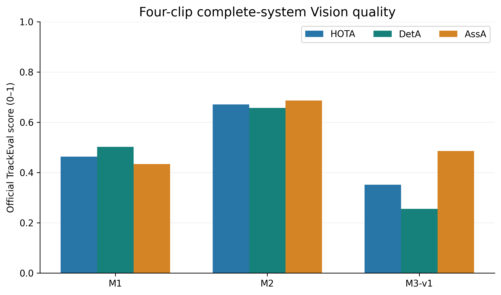
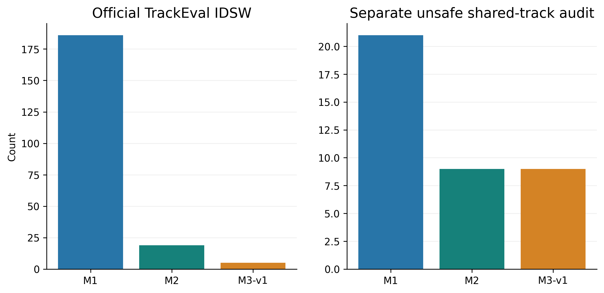
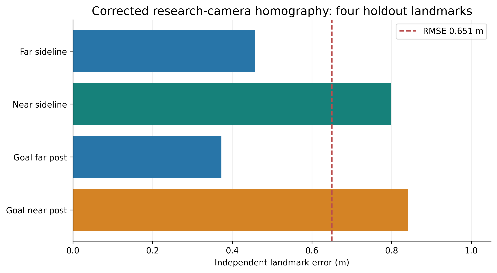
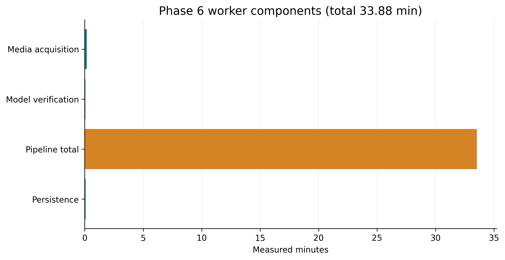
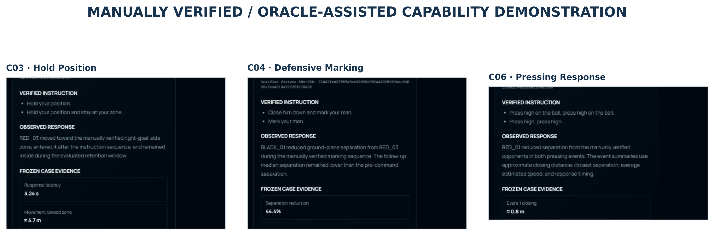
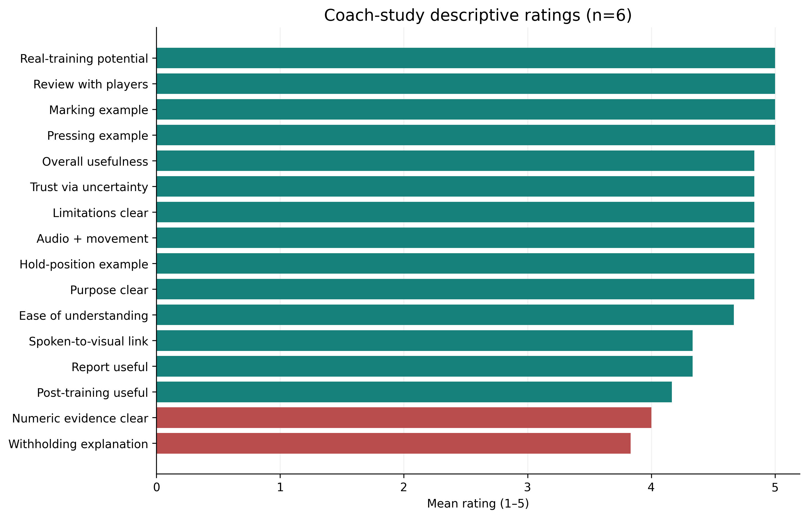
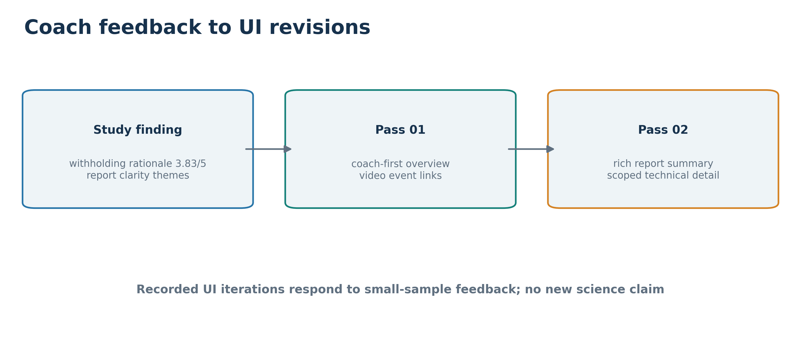

# Chapter 5 — Evaluation (2,333 words, including tables; excluding captions)

## 5.1 Evaluation strategy and success criteria

In the preliminary report, I proposed visual checking of detections, tracking consistency, transcript comparison and user feedback. Those were reasonable starting checks for a single-image prototype, but they could not answer the final research question. I developed four connected evaluation layers: **components** (ASR, reporting and calibration), **complete Vision methods** on frozen ground truth, **product integration** on a full session, and **stakeholder review** of the interface. Each layer tests a different claim. Word error rate cannot establish whether a tactical instruction was extracted; a high tracking score cannot establish safe physical-player identity; a successful API response cannot show that a coach understands the report.

I therefore judged success against the project objectives separately: comparative model selection, temporal multimodal fusion, justified physical measurements, evidence-grounded reporting, a working product and coach usefulness. The identity and calibration gates were acceptance criteria for *claims*, not merely debugging indicators. Crucially, an acceptable product result may be `COMPLETED_WITH_LIMITATIONS` if unavailable evidence is withheld accurately. This chapter reports both achievement and failure without treating a promising component score as permission for a stronger end-to-end claim.

## 5.2 Formal Vision evaluation

The final Vision test used four frozen, densely annotated challenge clips covering re-entry, occlusion, same-team interaction and a long gap. Together they contained **3,780 scored frames per method**. M1, M2 and M3-v1 each ran as their complete frozen detector–appearance–tracker pipeline. I reset tracker and association state at the start of each clip, then preserved state within that clip. Predictions from all twelve method–clip runs were saved and hashed before dense ground truth was loaded for scoring. This order protected the held-out comparison from threshold adjustments after seeing the answers; it does not turn the four clips into proof of continuous full-session identity.

I used HOTA to read detection and association quality together, and DetA and AssA to inspect those parts separately (Luiten *et al.*, 2021). MOTA, IDF1 and official ID switches (IDSW) add complementary views; false positives (FP), false negatives (FN), precision and recall show how much of the scene each method actually retained (Bernardin and Stiefelhagen, 2008; Ristani *et al.*, 2016). Table 5.1 gives the aggregate values on a 0–1 scale, except counts. Figure 5.1 visualises the HOTA decomposition.

| Method | HOTA | DetA | AssA | MOTA | IDF1 | IDSW | FP | FN | Precision | Recall |
|---|---:|---:|---:|---:|---:|---:|---:|---:|---:|---:|
| M1 | 0.4632 | 0.5020 | 0.4333 | 0.5673 | 0.5891 | 186 | 6,004 | 2,931 | 0.7514 | 0.8609 |
| M2 | **0.6710** | **0.6567** | **0.6862** | **0.8522** | **0.9144** | 19 | 224 | 2,873 | 0.9878 | 0.8637 |
| M3-v1 | 0.3517 | 0.2551 | 0.4852 | 0.3253 | 0.4066 | 5 | 36 | 14,180 | 0.9948 | 0.3273 |

*Table 5.1. Official TrackEval aggregate for the four independent challenge clips; rows are whole-method results.*

*Figure 5.1. M2 leads aggregate HOTA, DetA and AssA in the frozen complete-system comparison.*

M2 had the strongest observed benchmark performance, supporting its `AUTO` selection. Its HOTA and IDF1 led on every challenge clip, yet the same-team interaction clip still had lower M2 recall (**0.7754**) than the aggregate (**0.8637**). Similar kits and crossings therefore remained a meaningful stress case. This is a whole-system comparison: because detector histories and association paths differ, the advantage cannot be assigned to RF-DETR, ReID or GTA alone without a controlled ablation.

The critical result is what this **did not** establish. A separate one-to-one identity audit found unsafe shared-track attribution in **21 M1, nine M2 and nine M3-v1 track IDs**; every method retained `FAIL_UNSAFE_MERGE`. Figure 5.2 keeps that audit distinct from TrackEval IDSW. These counts must not be added together: an official switch and a track ID associated with more than one person answer different questions. Nor does M3-v1's five IDSW make it the safest method. Its recall was only **0.3273**, with **14,180 FN**; many trajectories were not observed long enough to create switch opportunities. Even M2's high IDF1 is a clip-level aggregate, not a guarantee that one physical player retains an identity across a training session. A wrong shared identity could contaminate a coaching judgment despite a strong average score. I consequently kept player-level accumulated analytics withheld in the product.

*Figure 5.2. Official ID switches and the separate unsafe shared-track audit diagnose different failures.*

## 5.3 ASR and LLM evaluation

For coaching audio, I compared Candidate A, `faster-whisper base.en`, with Candidate B, Parakeet TDT 0.6B v2, under the corrected frozen tactical-event protocol. A achieved **18.4% WER** and **11.86% CER**; B reached **36.8%** and **23.29%**. More relevant to this system, A's tactical-event precision, recall and F1 were **92.86%, 76.47% and 83.87%**, compared with B's **90.00%, 52.94% and 66.67%**. A found thirteen true events with four misses, whereas B found nine with eight misses; both had one false event. The larger recall difference mattered because a missed instruction gives Fusion no event to inspect, even if other transcript words are correct. A was therefore selected for this recording and event taxonomy. These figures do not rank the models universally, and candidate runtimes used different hardware. The earlier event-boundary circularity was corrected before the frozen comparison, so selection rests on the corrected protocol.

The language comparison tested frozen Qwen3:8B and Llama 3.1:8B cases for delivery and schema validity as well as grounding. Llama completed and produced schema-valid output in **15/16** cases, versus Qwen's **5/16**; Qwen timed out in eleven cases and Llama in one. Both candidates avoided unsupported player identity and misuse of unavailable evidence in the selection assessment. I chose Llama for its more reliable structured delivery, then retained the eight-gate Patch 001 validator and deterministic fallback. An important nuance emerged: the *pre-patch* numeric validator flagged authorised numbers embedded in string observations. Its raw gate-pass count must not be read as a count of hallucinations, and the full sixteen-case benchmark was **not** rerun after the patch. A bounded real C04 test passed all eight patched gates, while the later full-session product report used fallback. That separation limits the claim to what was actually tested.

## 5.4 Calibration evaluation

The corrected research-camera homography was tested against **four independent landmarks** that were not used to fit it. The ground-plane root mean square error was approximately **0.651 m**, and the largest point error was **0.841 m** (Figure 5.3). This supports a moderate-confidence estimate for the measured **19.31 m × 19.88 m** pitch and original camera geometry. It is not a universal uncertainty figure for every phone position or video copy. A proposed transfer to a different development camera was rejected when its error was much larger, reinforcing the need for camera-specific validation.

*Figure 5.3. Independent landmark residuals validate only the original research camera and pitch geometry.*

The Phase 6 cloud input was a derived transport copy with a different media hash. The product correctly assigned `NO_METRIC_CALIBRATION` and withheld metres and km/h, even though the original source had a validated homography. Calibration accuracy and calibration **permission** are separate results. Likewise, identity failure would still prevent accumulated player metrics on a calibrated source. This is an example of evaluation changing the behaviour of the system rather than simply providing a number for the report.

## 5.5 Full-session product evaluation

The decisive integration test used the complete **340-second** derived transport recording, with **20,391 frames** and the full coach-audio timeline. Figure 4.4 records why the 2.39 GB research original needed a separate full-duration upload copy; its use here did not alter the frozen Vision benchmark. Before dispatch, I checked transport suitability at seven predetermined moments. M2 returned 40 detections on each version; all 40 could be paired at IoU at least 0.3, with per-sample median IoU about 0.933–0.960. This bounded check justified using the copy for a product trial, not transferring the formal scores or camera calibration. The real Supabase–Modal job then exercised private media acquisition, M2 checkpoint verification, Vision, ASR, Fusion, reporting, persistence, authenticated callback and result retrieval. Table 5.2 summarises what the persisted product actually returned.

| Observed field | Full-session result |
|---|---|
| Requested → executed method | `AUTO` → M2 complete pipeline |
| Tactical events / structured evidence | 13 / 28 |
| Job / report | `COMPLETED_WITH_LIMITATIONS` / `DETERMINISTIC_FALLBACK` |
| Formal identity / player analytics | `FAIL_UNSAFE_MERGE` / withheld |
| Calibration / physical values | `NO_METRIC_CALIBRATION` / unavailable |
| Response windows without observations | 6 |

*Table 5.2. Persisted Phase 6 result; unavailable physical values are not observed zeros.*

The events comprised six Pressing, four Positioning / Hold Ground and three Defensive instructions. All automated player targets remained unresolved. Six response windows had no persisted tracked observations; some reached beyond the media end. The correct interpretation is **insufficient visual evidence**, not that a player failed to respond. A bounded check still found detections near some of these windows, but it did not establish the root cause of missing full-run tracking observations, so I did not retune thresholds after the result. The dispatch succeeded and the canonical result was retrieved through the backend, confirming persistence rather than just a completed worker log.

The worker took **2,032.682 s**, about **33 min 53 s**, for this 340-second input. Figure 5.4 shows that the measured pipeline aggregate accounted for **2,012.314 s**; individual Vision, ASR, Fusion and report durations were not separately instrumented. The run proves full-path execution with honest limitations, while its runtime and missing windows expose practical weaknesses. It does not constitute a 20,391-frame dense-ground-truth tracking benchmark or a validated full-session Llama report.

*Figure 5.4. Measured Phase 6 components; stage-level model timings were unavailable.*

## 5.6 Oracle-assisted capability showcase

The C03 Hold Position, C04 Defensive Marking and C06 Pressing Response cases test a different question: can the downstream tactical logic express useful evidence **when identity, instruction target and relevant spatial relationships have been manually verified**? Figure 5.5 presents these frozen examples. C03 concerns tactical-zone retention, C04 a close-down relationship and C06 pressing response. The verification included opponent relationships and, where relevant, the tactical-zone meaning; it was not simply a hand-entered player name. Their manual conditions support case-specific interpretations, illustrated by overlays or a contact sheet. The automated run cannot inherit those physical-player claims.

*Figure 5.5. C03, C04 and C06 are manually verified capability demonstrations.*

I retained the showcase because it separates a limitation in **upstream attribution** from the potential of downstream fusion and explanation. It is not an alternative benchmark score for M1–M3, nor evidence that automated persistent identity succeeded. The UI explicitly labels the cases as `ORACLE_ASSISTED_CAPABILITY_DEMONSTRATION`; the frozen combined report remains one source covering three cases. This lets coaches inspect what the system could support under stronger input evidence without confusing that evidence with the real product run.

## 5.7 Software testing and verification

I tested the product at several boundaries: typed adapters and safety rules, ASR/Fusion and report validation, server-side media checks, idempotent job dispatch, signed media access, worker callbacks and result persistence. A bounded cloud smoke verified the whole lifecycle before the full run; the real Phase 6 job then persisted a retrievable result. After the Phase 6 provenance changes, **38 focused backend tests passed**, and the frontend build and TypeScript check passed. Browser checks exercised the result route, private playback, event seeking, report rendering and showcase labels.

The later **broad** local backend suite did not finish cleanly. Windows temporary-directory permissions, an Ultralytics native access violation, intermittent read-only G: availability and one local model out-of-memory failure interrupted it; a workspace-temp attempt reached **265 passes** before the environmental failures. The earlier **271-pass** result belongs to a pre-Phase-6 code state and is not a final regression claim. I also rechecked the result route after fixing a nested-route issue that had initially shown only telemetry. Some browser checks, such as deliberately forcing signed-URL expiry and byte-comparing a downloaded Markdown file, remained unverified. These qualifications leave strong focused and real cloud lifecycle evidence, but not a claim of a fully clean final broad suite.

## 5.8 Coach study and iterative design

I conducted a consented, formative questionnaire with **six** football stakeholders: two head coaches, two assistant coaches, one analyst and one former player. Participants rated sixteen statements on a five-point Likert scale and gave open responses after seeing clearly separated automated results and manually verified showcase examples. All six expressed interest in testing a more complete version in real training; this records stated interest, not adoption. This small purposive sample can describe reactions to the prototype, not estimate a wider coaching population or measure player performance.

The overall usefulness mean was **4.83/5**. Combining spoken instructions with movement also scored **4.83/5**, and the pressing and marking showcase examples each scored **5.00/5**. Yet the clarity of **why player-level results were withheld** was the weakest item, at **3.83/5**; numerical evidence clarity was **4.00/5**. Figure 5.6 shows the item means. These ordinal-item means are descriptive summaries of six answers, not precision estimates. The contrast was useful feedback: participants valued the concept and honest uncertainty, but the explanation of that uncertainty still needed work. Written comments asked for simpler coaching language, a readable report, key information first, event-to-video navigation and clearer separation of automated from manually verified outputs. These were themes across responses, not views attributed to every participant.

*Figure 5.6. Six respondents rated usefulness highly; withholding explanation was the lowest mean.*

I translated these observations into two bounded UI passes (Figure 5.7). Pass 01 added rich report rendering, a coach-first overview with expandable technical detail, and event-to-video seeking. Pass 02 shared the report renderer across full-session and showcase routes and added a Coach-Friendly Summary derived from existing evidence. The second pass also fixed a route-level presentation inconsistency I found; it was not a new complaint attributed to participants. Neither pass changed the frozen models or persisted result. **No second post-iteration user study was conducted**, so the evidence supports “feedback informed changes,” not a numerical usability improvement.

*Figure 5.7. Coach-study feedback informed two presentation passes; no measured post-change effect is claimed.*

## 5.9 Critical evaluation, limitations and extensions

The project progressed beyond the preliminary detection demonstration: it compared complete methods, integrated speech and vision, ran a full product session, guarded unsupported reports and obtained stakeholder feedback. Its strongest conclusion is **bounded usefulness**. Table 5.3 links the main limits to the claims withheld and the next research or product step.

| Limitation observed | Current consequence | Next step |
|---|---|---|
| Persistent identity unsafe | No accumulated player analysis | Improve and re-evaluate re-entry/association |
| Camera-specific calibration | No arbitrary-video metres or km/h | Validate calibration per new camera |
| Six missing response windows | No response inferred | Diagnose tracking coverage and media edges |
| 33 min 53 s worker time | Slow post-session turnaround | Profile and optimise inference |
| No full-session overlay | Review relies on events and video | Generate scoped clips or overlays |
| Six-person formative study | No population or post-change claim | Larger repeated coach study |

*Table 5.3. Evidence limits and corresponding future work; proposed steps are not current capabilities.*

Future work can also examine team shape and comparison across sessions, but individual longitudinal claims first require safe identity. The evaluation therefore answers the research question conditionally: multimodal orchestration works as a review aid when the product exposes exactly where its evidence ends.
